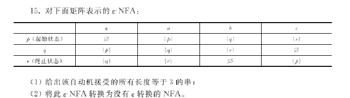

1. aac, abb, abc, aca, acb, acc, bab, bac, bba, bbb, bbc, bca, bcb, bcc, caa, cab, cac, cba, cbb, cbc, cca, ccb, ccc 共 23 种
2. M = ({p, q, r}, {a, b, c} U {$\sigma$}, $\delta$, p, {r})

| $\qquad$$\qquad$ | $\qquad$a$\qquad$ | $\qquad$b$\qquad$ | $\qquad$c$\qquad$ | 
| :---: | :---: | :---: | :---: |
|$p$|$\{p\}$|$\{p, q\}$| $\{p, q, r\}$|
|$q$|$\{p, q\}$|$\{p, q, r\}$| $\{p, q, r\}$|
|$r$| $\{p, q, r\}$|$\{p, q, r\}$| $\{p, q, r\}$|
