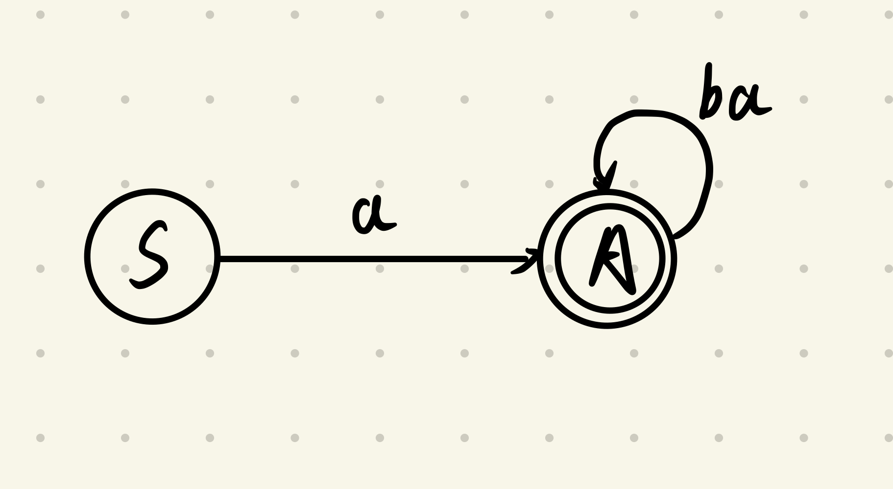
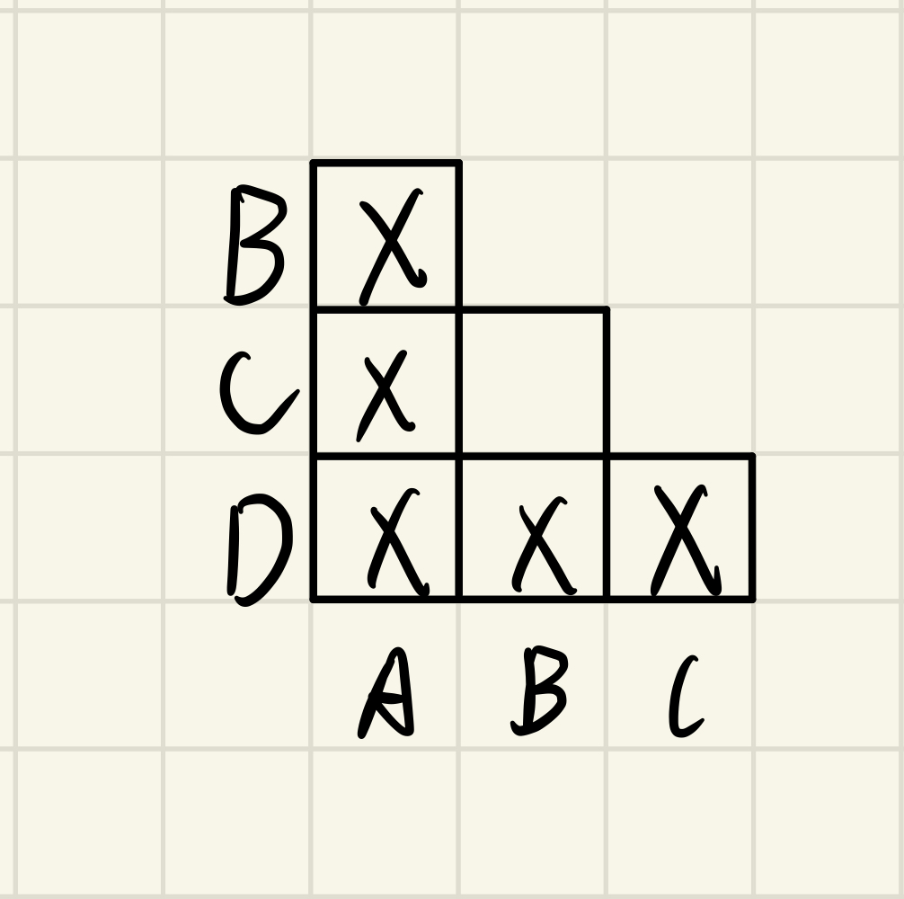

1、设正则集为 $a(ba)^*$

(1) 构造右线性文法

> 设右线性文法 $G = (\{S, A\}, \{ a , b \} , P , S )$
> $$S \rightarrow aA \\ A \rightarrow baA|\epsilon$$

(2) 找出 (1) 中文法的有限自动机

> 

2、已知 $DFA$ 的状态转移表如下，构造最小状态的等价 $DFA$
||$\qquad$ $0$ $\qquad$|$\qquad$ $1$ $\qquad$|
|:---:|:---:|:---:|
|$\rightarrow A$|$B$|$A$|
|$B$|$D$|$C$|
|$C$|$D$|$B$|
|$*D$|$D$|$B$|
|$E$|$D$|$F$|
|$F$|$G$|$E$|
|$G$|$F$|$G$|
|$H$|$G$|$D$|

> 1. 由状态转移表可知，由初始状态 $A$ 不可到达状态 $E、F、G、H$，删去得到的 $DFA$ 为 $A = (\{A, B, C, D\}, \{0, 1\}, \delta, \{A\}, \{D\})$，其中，$\delta$ 为 
> 
> ||$\qquad$ $0$ $\qquad$|$\qquad$ $1$$\qquad$|
> |:---: | :---: | :---: |
> |$\rightarrow A$|$B$|$A$|
> |$B$|$D$|$C$|
> |$C$|$D$|$B$|
> |$*D$|$D$|$B$|
>
> 2. 根据填表法，得
> 
> 状态集划分为 $\{A\}, \{B, C\}, \{D\}$
> 
> 3. 新的状态集合为 $[A], [B], [D]$，对应的最小状态等价 $DFA$ 为 $B = (\{[A]\}, \{0, 1\}, \delta, \{[A]\}, \{[D]\})$，其中，$\delta$ 为 
>
> ||$\qquad$ $0$ $\qquad$|$\qquad$ $1$$\qquad$|
> |:---: | :---: | :---: |
> |$\rightarrow [A]$|$[B]$|$[A]$|
> |$[B]$|$[D]$|$[B]$|
> |$*[D]$|$[D]$|$[B]$|