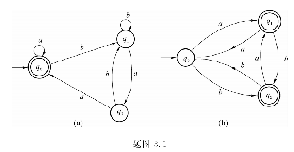
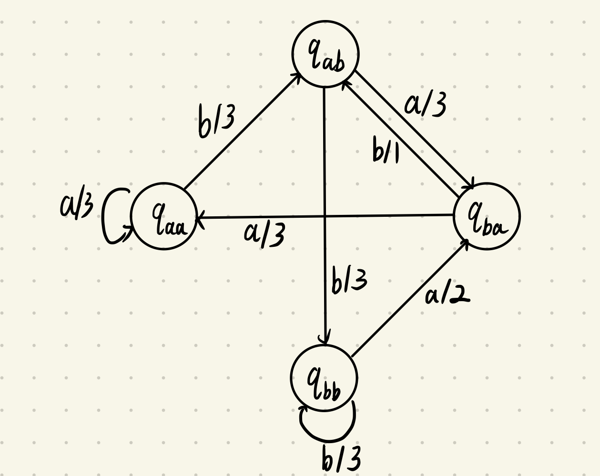
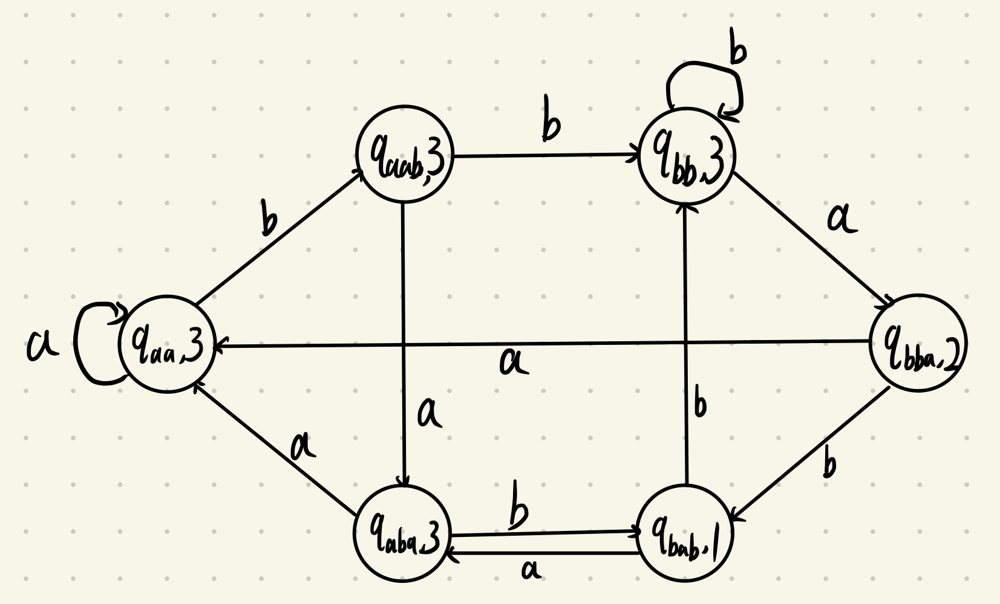

> 9、对应题图 3.1(a) 和 (b) 的状态转换图写出正则式

(a) 先将自动机转换为右线性文法 $G = \{N, T, P, S\}, T = \{a, b\}, N = \{S, A, B\}$
$$S \rightarrow \epsilon|aS|bA \\ A \rightarrow bA | aB \\ B \rightarrow bA | aS$$ 即 $$S = \epsilon + aS + bA \\ A = bA + aB \\ B = bA + aS$$ $$A = (b + ab)A + aaS \\ A = (a + ab)^*aaS \\ S = \epsilon + aS + b(a + ab)^*aaS \\ = \epsilon + (a + b(a + ab)^*aa)S \\ = (a + b(a + ab)^*aa)^*$$

(b) 先将自动机转换为右线性文法 $G = \{N, T, P, S\}, T = \{a, b\}, N = \{S, A, B\}$
$$S \rightarrow aA|bB \\ A \rightarrow \epsilon|aS|bB \\ B \rightarrow \epsilon|bS|aA$$ 即 $$S = aA + bB \\ A = \epsilon + aS + bB \\ B = \epsilon + bS + aA$$ $$A = \epsilon + aS + bbS + baA + b \\ = (ba)^*(b + (a+bb)S) \\ S = aA + b + bbS + baA \\ = (a + ba)(ba)^*(b + (a + bb)S) + b + bbS \\ = ((a + ba)(ba)^*(a + bb) + bb)^*((a + ba)(ba)^*b + b)$$

> 18、构造米兰机和摩尔机
对于 $\{a, b\}^*$ 的字符串，如果输入以 $bab$ 结尾，则输出 1；如果输入以 $bba$ 结尾，则输出 2；否则输出 3

$q_{aa}$ 表示在这个状态时，输入字符串以 aa 结尾，其余同理

aaaacbSbcbc