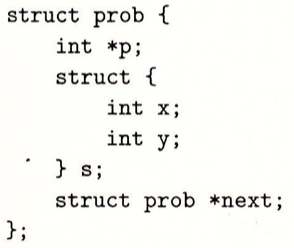
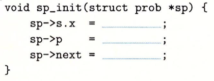
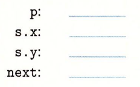
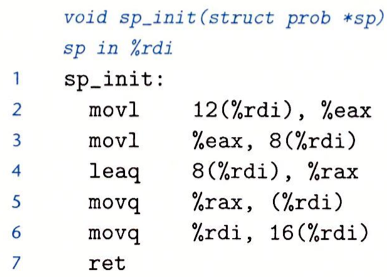
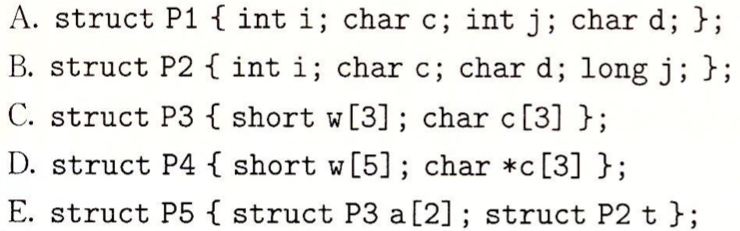
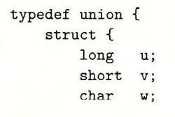
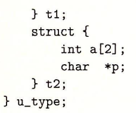
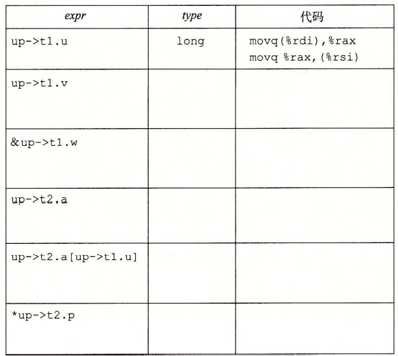
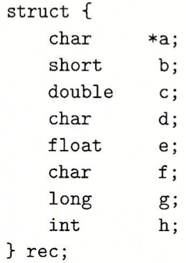

1、考虑下面的结构声明：


这个声明说明一个结构可以嵌套在另一个结构中，就像数组可以嵌套在结构中、数组可以嵌套在数组中一样。
下面的过程（省略了某些表达式）对这个结构进行操作：


A. 下列字段的偏移量是多少（以字节为单位）？


B. 这个结构总共需要多少字节
> 24个字节

C. 编译器为 *sp_init* 的主体产生的汇编代码如下：

根据这些信息，填写 *sp_init* 代码中缺失的表达式。
```
void sp_init(struct prob *sp) {
    sp->s.x = sp->s.y;
    sp->p = &(sp->s.x);
    sp->next = sp;
}
```

2、对下面每个结构声明，确定每个字段的偏移量、结构总的大小，以及在x86-64下它的对齐要求：

> 以下单位均为字节
> A. 偏移量：*i*: 0; *c*: 4; *j*: 8; *d*: 12；结构大小：16；对齐：4
> B. 偏移量：*i*: 0; *c*: 4; *d*: 5; *j*: 8；结构大小：16；对齐：8
> C. 偏移量：*w*: 0; *c*: 6；结构大小：10；对齐：2
> D. 偏移量：*a*: 0; *t*: 24；结构大小：40；对齐：8

3、假定给你个任务，检查一下C编译器为结构和联合的访问产生正确的代码。你写了下面的结构声明：


你写了一组具有下面这种形式的函数：
```
void get(u_type *up, type *dest) {
       *dest = expr;
}
```
这组这组函数有不一样的访问表达式 *expr*，而且根据 *expr* 的类型来设置目的数据类型 *type*。然后再检查编译这些函数时产生的代码，看看它们是否与你预期的一样。
假设在这些函数中，*up* 和 *dest* 分别被加载到寄存器%rdi和%rsi中。填写下表中的数据类型type，并用1~3指令序列来计算表达式，并将结果存储到dest中。


4、对于下列结构声明回答后续问题:

A. 这个结构中所有的字段的字节偏移量是多少？
> *a*: 0; *b*: 8; *c*: 16; *d*: 24; *e*:28; *f*: 32; *g*: 40; *h*: 48

B. 这个结构总的大小是多少？
> 56字节

C. 重新排列这个结构中的字段，以最小化浪费的空间，然后再给出重排过的结构的字节偏移量和总的大小。
> *a、c、g、e、h、b、d、f*
> 偏移量：*a*: 0; *c*: 8; *g*: 16; *e*: 24; *h*:28; *b*: 32; *d*: 34; *f*: 35
> 总大小：36字节

5、什么是异常？异常有哪几种类型？
> 异常就是控制流中的突变，用来响应处理器状态的某些变化。
> 中断、陷阱、故障、终止