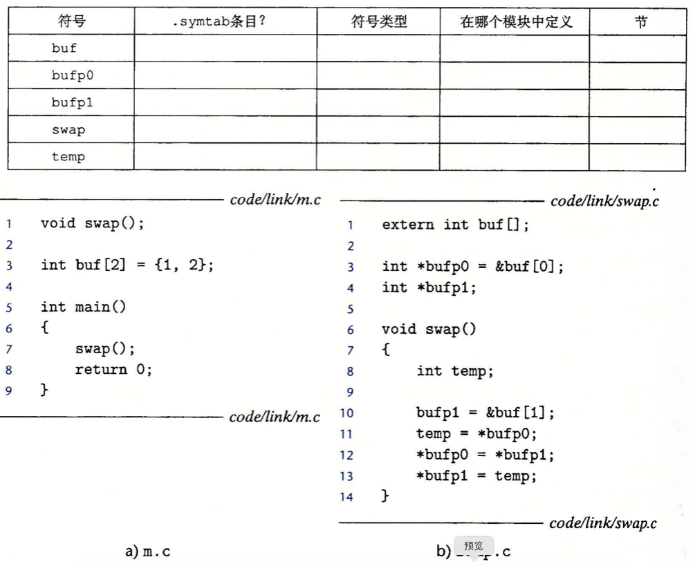

1、这个题目针对图 *7-5* 中的 *m.o* 和 *swap.o* 模块。对于每个在 *swap.o* 中定义或引用的符号，请指出它是否在模块 *swap.o* 中的 *.symtab* 节中有一个符号表条目。如果是，请指出定义该符号的模块（*swap.o* 或者 *m.o*）、符号类型（局部、全局或者外部）以及它在模块中被分配到的节（*.text*、*.data*、*.bss* 或 *COMMON*）

2、在此题中，REF（x.i）-> DEF（x.k）表示链接器将把模块 *i* 中对符号 *x* 的任意引用与模块 *k* 中 *x* 的定义关联起来。对于下面的每个示例，用这种表示法来说明链接器将如何解析每个模块中对多重定义符号的引用。如果有一个链接时错误（规则1），写“错误”。如果链接器从定义中任意选择一个（规则3），则写“未知”。

3、下图为可执行文件 *prog* 已重定位的 *.text* 节。原始的 *C* 代码在教材的图 *7-1* 中

A. 第5行中对sum的重定位引用的十六进制地址是多少？
> 0x4004df

B. 第5行中对sum的重定位引用的十六进制值是多少？
> 0x5

4、考虑目标文件 *m.o* 中对 *swap* 函数的调用（教材图 *7-5* 所示）

现在假设链接器将 *m.o* 中的 *.text* 重定位到地址 *0x4004d0*，将 *swap* 重定位到地址 *0x4004e8*。那么 *callq* 指令中对 *swap* 的重定位引用的值是什么？
> ADDR(S) = ADDR(.text) = 0x4004d0
> ADDR(r.symbol) = ADDR(swap) = 0x4004e8
> refaddr = ADDR(S) + r.offset = 0x4004da
> *refptr = (unsigned)(ADDR(r.symbol) + r.addend - refaddr) = 0xa
> 故引用的值为 0xa
