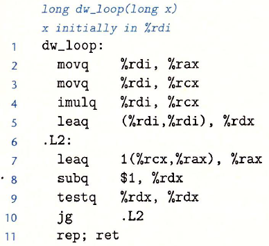
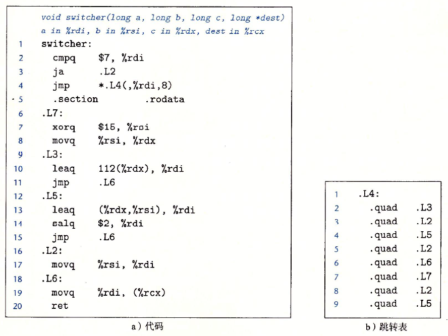

1. 已知 *C* 代码如下：

*GCC* 产生的汇编代码如下：

A. 哪些寄存器用来存放程序值*x*、*y* 和 *n*?
> x: %rdi
> y: %rcx
> z: %rdx

B. 编译器如何消除指针变量 *p* 和表达式 *(\*p)++* 隐含的指针间接引用的需求？
> 编译器认为指针变量 *p* 在这段代码中总是指向变量 *x* 的，所以直接将 *(\*p)++* 改写成对 *x* 的操作，并通过第 $7$ 行的 *leaq* 指令同时实现 *x++* 和 *x += y*

C. 对汇编代码添加一些注释，描述程序的操作，类似于教材图 *3-19c* 中所示的那样。

3.26
2. 函数 *fun_a* 有如下整体结构：

*GCC* 编译器产生如下汇编代码：

逆向工程这段代码的操作，然后完成下面作业：

A. 确定这段代码使用的循环翻译方法
> 跳转至中间(*jump to middle*)翻译方法

B. 根据汇编代码版本填写 *C* 代码中缺失的部分。

C. 用自然语言描述这个函数是计算什么的。
> 判断 *x* 的二进制表示中有奇数或偶数个 $1$。如果有奇数个 $1$，则返回 $1$；如果有偶数个 $1$，则返回 $0$

3. 函数 *fun_b* 有如下整体结构：

*GCC* 产生的汇编代码如下：

逆向工程这段代码的操作，然后完成下面作业：

A. 根据汇编代码版本填写 *C* 代码中缺失的部分。

B. 解释循环前为什么没有初始测试也没有初始转跳到循环内部的测试部分。
> 因为 *i* 被初始化为 $64$，编译器发现其一定满足测试 *i != 0*，因此优化掉了初始测试

C. 用自然语言描述这个函数是计算什么的。
> 将 *x* 的二进制位反转

1. 对于一个通用结构的 *C* 函数 *switcher*：

*GCC* 产生下面所示的汇编代码和转跳表：

填写 *C* 代码中缺失的部分。除了情况标号 *C* 和 *D* 的顺序之外，将不同情况填入这个模板的方法是唯一的。
