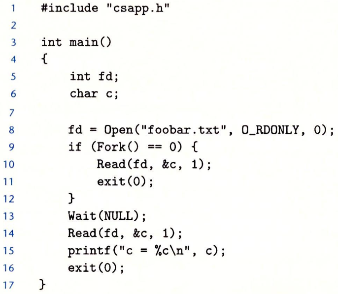

1、下面程序的输出是什么？


> *open* 函数总是返回最低的未打开的描述符。而在进程生命周期开始时，描述符 $0,\ 1,\ 2$ 分别被赋予 *stdin*，*stdout*，*stderr*。故第一次调用 *open* 函数后返回描述符 $3$，调用 *close* 函数会释放描述符 $3$，这时再调用 *open* 函数仍会返回描述符 $3$。输出如下
```
fd2 = 2

```


2、假设磁盘文件 *foobar.txt* 由 $6$ 个 *ASCII* 码字符 “*foobar*” 组成。那么,下列程序的输出是什么?


> 每个描述符都有自己的文件位置，故调用 *Read(fd2, &c, 1)* 时会将原来读入的 *f* 覆盖为 *f*。输出如下
```
c = f

```

3、就像前面那样，假设磁盘文件 *foobar.txt* 由 $6$ 个 *ASCII* 码字符 “*foobar*” 组成。那么下列程序的输出是什么？


> 子进程会继承父进程的描述符表，其共享同一个打开文件表。由于 *Wait* 函数的存在，在调用 *if* 之外的 *Read* 函数时子进程已经执行了 *if* 中的语句，导致文件位置加 $1$。之后父进程再调用 $Read$ 函数会读取第二个字节。输出如下
```
c = 0

```
4、假设磁盘文件 *foobar.txt *由 $6$ 个 *ASCII* 码字符 “*foobar*” 组成，那么下列程序的输出是什么？


> 第一次调用 *Read* 函数会使 *fd2* 的文件位置加 $1$，然后调用了 *Dup2* 函数，将 *fd1* 重定向至 *fd2*，因此此时 *fd1* 的文件位置即是 *fd2* 的文件位置，再次调用 *Read* 函数会读取第二个字节。输出如下
```
c = o

```