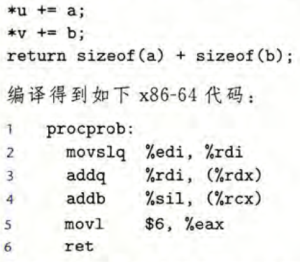
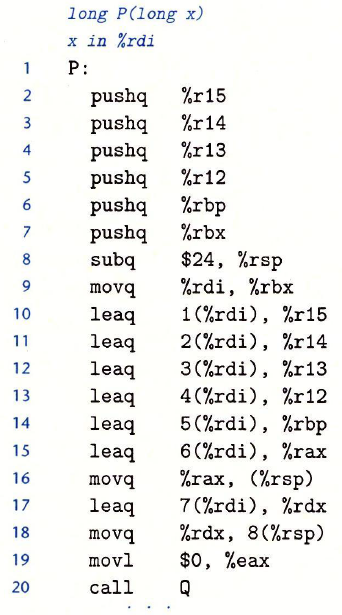
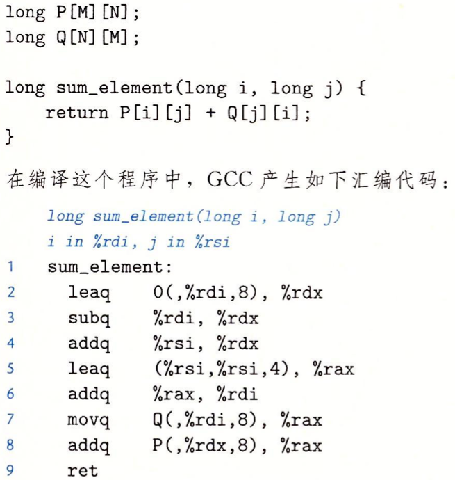
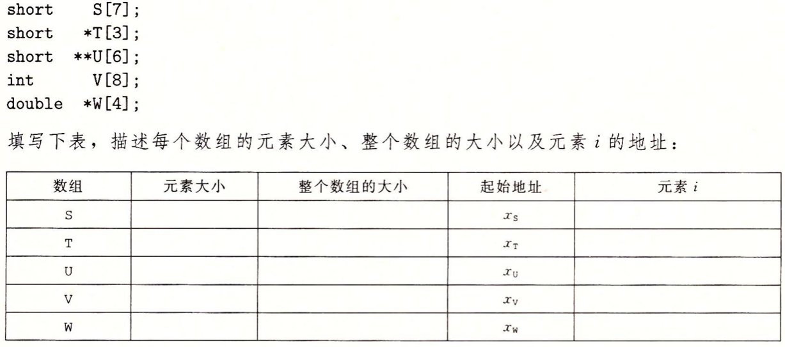
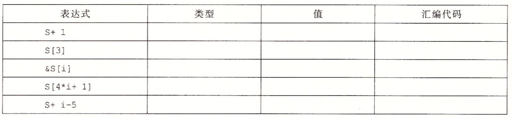

1、已知 *IEEE754* 单精度浮点数的值为 $0xC0B00000$，则它的十进制值为多少？
> 将 $0xC0B00000$ 转换为二进制 $1100$ $0000$ $1011$ $0000$ $0000$ $0000$ $0000$ $0000$ 
第一位是符号位，为 $1$，说明是负数；第 $2$ $\sim$ $9$ 位是指数位，为 $10000001$，说明 *E* $= 129 - 127 = 2$；后 $23$ 位是尾数位，为
$0110$ $0000$ $0000$ $0000$ $0000$ $000$；故结果为 $-101.1_2 = -5.5_{10}$

2、 假定变量 *x*、*f* 和 *d* 的类型分别是 *int*、*float* 和 *double*。 除了 *f* 和 *d* 都不能等于$+\infty$、$-\infty$或者 *NaN*，它们的值是任意的。对于下面每个 *C* 表达式，证明它总是为真（也就是求值为 $1$ ）， 或者给出一个使表达式不为真的值（也就是求值为 $0$ ）。
A. x ==  (int)（double）x
> 总为真。因为 *double* 类型的尾数位最大为 $52$ 位，而 *int* 型符号位之后的位数最多只有 $31$ 位，进行类型转换时不会发生截断

B. x == (int)（float）x
> 当 $x = 16777217$ 时，$(int)(float)x = 16777216$

C. d == (double)（float）d
> 当 $x = 1.167167167$ 时，$(double)(float)x = 1.167167186$

D. f == (float)（double）f
> 总为真。*double* 类型的指数位数和尾数位数都比 *float* 多，因此在类型转换时不会发生截断

E. f == -(- f)
> 总为真。取负号只影响第一位符号位，所以两次取负号一定与原来相等

F. 1.0 / 2 == 1 / 2.0
> 总为真，得出的结果都为 $0.5$

G. d * d >= 0.0
> 总为真。由于浮点数的正负由符号位决定，因此后面位数的溢出并不会影响到其正负，而一个数的平方肯定大于等于 $0$，又 *d* 不为 *NaN*，所以 $d * d \geq 0$

H. (f + d)- f == d
> 当 *d* 非常小，*f* 非常大时，*d*有可能被忽略，导致运算结果为 $f -f = 0$；
$f = 1e20, d = 1e-20$ 时，$(f + d) - f = 0$

3、 *C* 函数 *procprob* 有 $4$ 个参数 *u*、*a*、*v* 和 *b*，每个参数要么是一个有符号数，要么是一个指向有符号数的指针，这里的数大小不同。该函数的函数体如下：

确定 $4$ 个参数的合法顺序和类型。有两种正确答案。
> 由所学知识，$4$ 个参数被依次存放在 *rdi, rsi, rdx, rcx* 寄存器中。根据原函数和汇编代码可以确定 *u* 在 %*rdx* 中，*v* 在 %*rcx*，*a* 在 %*rdi*，*b*在 %*sil*（即 %*rsi* 的低 *8* 位）。
故参数的顺序和类型为：*a(int)*，*b(char)*，*u(long\*)*，*v(char\*)*

4、一个函数 *P* 生成名为 *a0* ~ *a7* 的局部变量，然后调用函数 *Q*，没有参数。*GCC* 为 *P* 的第一部分产生如下代码：

A. 确定哪些局部值存储在被调用者保存寄存器中。
> *a0, a1, a2, a4, a4, a5* 储存在被调用者保存寄存器 *%rbx, %r15, %r14, %r13, %r12, %rbp* 中。

B. 确定哪些局部变量存在在栈上。
> *a6, a7* 存放在栈中相对于栈指针偏移量为 $0$ 和 $8$ 的位置

C, 解释为什么不能把所有的局部值都存储在被调用者保存寄存器中。
> 在储存完 *%a5* 后，被调用者保存寄存器被调用完了，剩下的局部变量只能存放在栈中

5、考虑下面的源代码，其中 *M* 和 *N* 是用 #*define* 声明的常数：

运用逆向工程技能，根据这段汇编代码，确定 *M* 和 *N* 的值。
> $2$ 将 $8i$ 存放在 *%rdx*中
> $3$ 将 *%rdx* 减去 *rdi*，即 $8i - i = 7i$
> $4$ 将 *%rdx* 加上 $j$，即 $7i + j$
> $5$ 将 $5j$ 存放在 *rax* 中
> %6% 将 *%rdi* 加上 $rax$，即 $i + 5j$
> $6$ 访问 $M[x_Q + 8(7i + j)]$ 位置的元素并存放到 *%rax* 中
> $7$ 访问 $M[x_P + 8(5j + i)]$ 位置的元素并将其加到 *%rax* 中
> 综上，我们可以看出对 *Q* 的引用在偏移 $8(7i + j)$ 的位置，对 *P* 的引用在偏移$8(5j + i)$ 的位置，故 $N = 7, M = 5$

6、考虑下面的声明：

7、假设短整型数组 *S* 的地址 $x_s$ 和整数索引 *i* 分别存放在寄存器 %*rdx* 和 %*rcx* 中。对下面每个表达式，给出它的类型、值的表达式和汇编代码实现。如果结果是指针的话，要保存在寄存器 %*rax* 中，如果数据类型为 *short*，就保存在寄存器元素 %*ax* 中。
