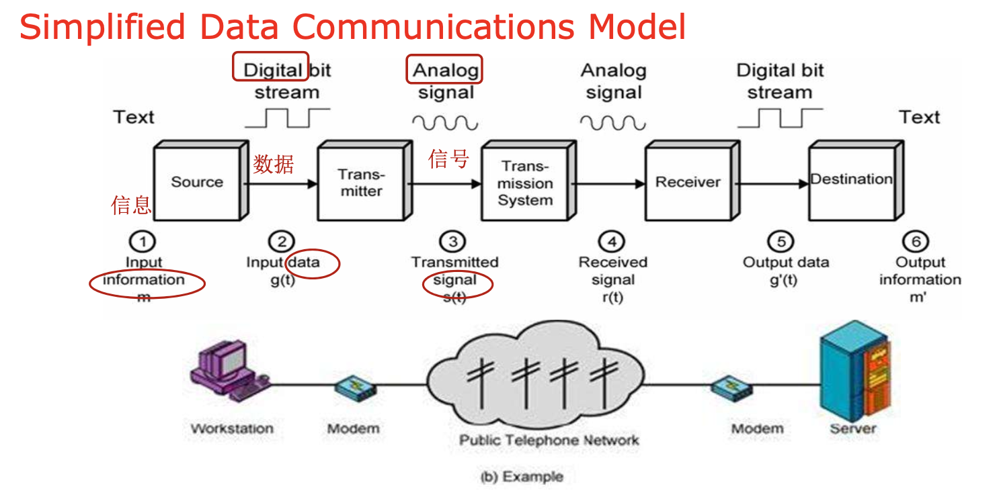
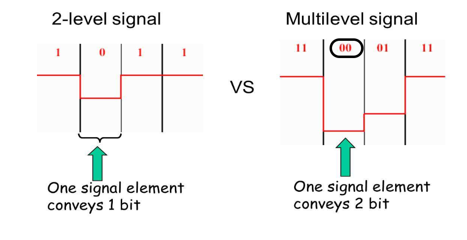
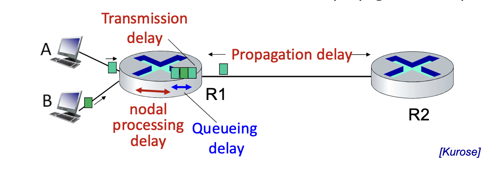
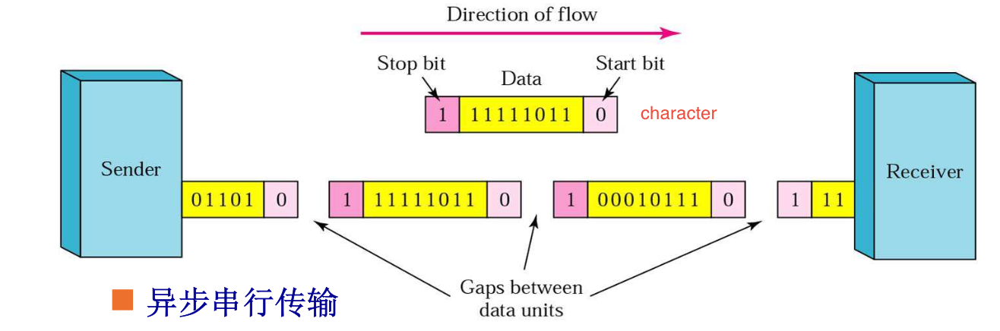
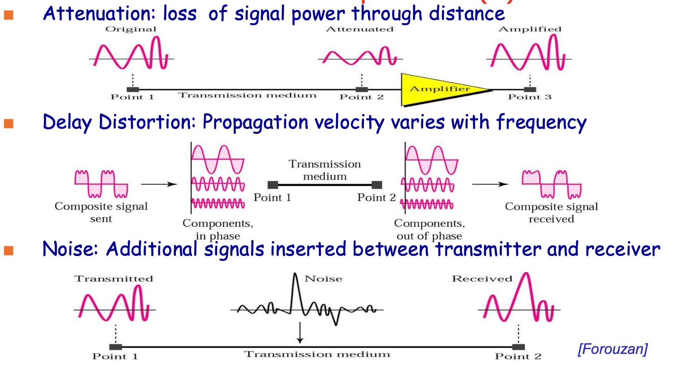
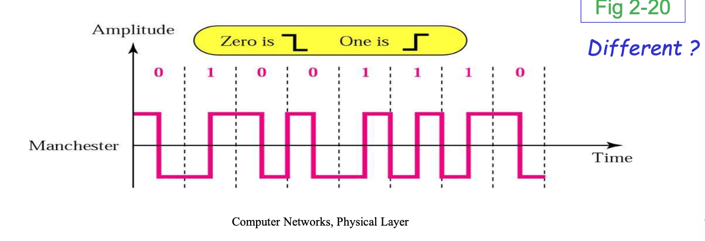
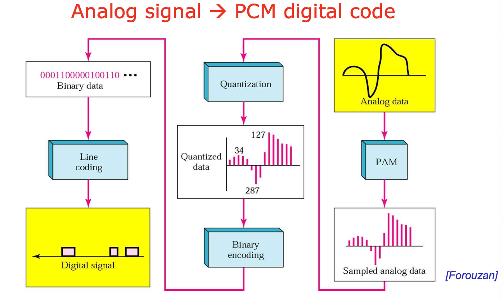
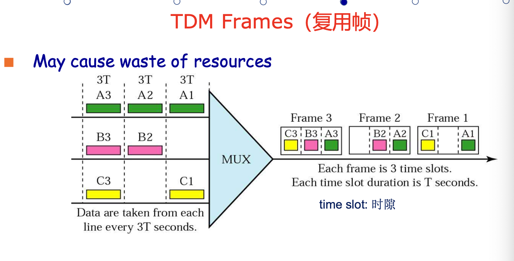
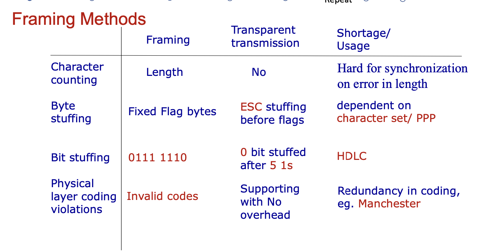
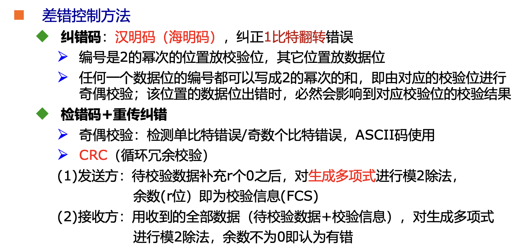

# PERSPECT

## Nouns Interpretation

1. Services

> each layer provides a certain function(services) to its upper layer through interfaces
> defines the operations of a certain layer on behalf of its users, but masks the implement of operations

2. Protocols
   
> A set of rules governing the format of messages
> services are implemented via protocols

1. Connection-oriented - Connectionless 

> In homework1

3. PDU : Protocol Data Unit(协议数据单元)

> information exchanged between two peers(entities in the same layer but different machines)

4. SAP : Service Access Point(服务访问点)

> layer n+1 can access the services offered by layer n in the SAPs of n

----------------------- Transport Layer -------------------------

5. UDP : User Datagram Protocol

> Using in connectionless
> For application which prompt matters more than accurate (real-time)

6. TCP : Transmission Control Protocol

> Using in Connection-oriented
> Flow Control and Congestion control

# Physical Layer

## Positions and Functions of Physical Layer

- Defines the electrical, timing and other inerfaces by which bits are sent as signal over channels
- Converts binary bits from data link layer to signals

## Basic concepts on data communications

> Source (Data link layer) data (Digital(数组) bits stream) inputs into Physical layer(Transmitter) and converts to Analog(模拟) signal, then through the transmission system to get to receiver, receiver's physical layer then converts it to digital bit stream and pass to the upper layer

### Nouns Interpretation

1. Channel(信道) : 传输信息的媒介
2. Bandwidth(带宽)(Hz) : The width of the frequency range transmitted without being strongly attenuated(减弱)
3. Bit Rate(数据率)(bps) : The number of bits transmitted per sec
4. Baud Rate(信号速率)(Baud) : The number of times per sec

> Baud Rate = 1/T (Period of a signal unit)
> 
> $$Bit Rate = Baud Rate * \log_2V$$

5. Channel Capacity(信道容量) : The maximal Bit Rate of a channel(Channel Bandwidth)
6. Throughput(吞吐量)(bps) : The Bits transfer within unit time
7. Load(负载)(bps) : The Bits inject into network? within unit time
8. Propagation Speed(传播速度)(m/s) : The distance signal can propagate the route within unit time
9. BER(Bit Error Rate)(误码率) : P = The Error Bits / Total Transfer Bits
10. Delay(时延) : The time elapsed(流逝) from the first bit being sent to the network until the last bit being received

> Consists of Delay:
> 
> 
> - Transmission Delay(发送时延) : The time required to send bits into link
> R = link bandwidth(bps) L = packet length(bits)
> transmission delay = L / R
> - Propagation Delay(传播时延) : The time signal passed through medium costs 
> d = length of physical link, s = propagation speed in medium
> propagation delay = d / s
> - Nodal Processing Delay(节点处理时延) : The time Switcher/Router spent checking bit errors and determine output link
> - Queuing Delay(排队时延) : The time spent in waiting at output link for transmission
> depends on congestion(拥挤) level of router

11. Simplex(单工) : Transmission occurs in only one direction
> FM Radio broadcasting
12. Half-duplex(半双工) : Transmission can be made in both direction, but only one direction is available at one time
> talkie and walkie(对讲机)
13. Full-duplex(全双工) : Transmission can be made in both directions simultaneously(同时地)
> Phone conversation
14. Asynchronous Transmission(异步传输)
> 
> - Independent clock, no synchronization required
> - Transmission in character units
> - The interval between sending two characters is arbitrary(随意的)
> - The receiver relies on the start bit and stop bit in the character to synchronize
15. Synchronous Transmission(同步传输)
> - Using clock signal line to perform bit synchronization of the signal on the link(transmit clock signal to inform receiver the beginning and end of a data block)
> - Transmitted in units of data blocks(frames or packets)
16. Transmission Impairment(损伤)
> 
> - Signal received may differ from signal transmitted
> - Analog - degradation of signal quality
> - Digital - bit errors
> - Caused by 
>   - Attenuation(衰减) and attenuation distortion(失真)
>   - Delay distortion(时延失真)
>   - Noise(噪声)

### Key Formula

#### Nyquist's Prove

In noiseless channel, if an arbitrary signal has been run through a low-pass filter of bandwidth B, the filtered signal can be completely reconstructed by making 2B samples per sec

#### Nyquist Bit Rate

In noiseless channel

$$Bit Rate = 2 \times bandwidth \times \log_2V$$

#### Shannon Theorem

In noisy channel

$$Capacity = bandwidth \times \log_2(1 + \frac{signal\_power}{noise\_power})$$

> We conventionally describe SBR on log scale as $$S/N_{db} = 10\log_{10}S/N(dB)$$

## Transmission medium

1. Twist Pair(双绞线)(consists of UTP or STP)
2. Coaxial Cable(同轴电缆)
3. Fiber Cables(光缆)
4. Radio Transmission
5. Microwave Transmission 
6. Communication Satellites
7. Infrared and Millimeter Waves

## Digital modulation(调制) and encoding

### Combination of modulation techniques

- Modems use a combination of modulation techiques to transmit multiple bits per baud
  1. QPSK : Quadrature Phase Shift Keying 正交相移键控
  2. QAM : Quadrature Amplotude Moduation 正交幅度调制
- Constellation Diagram(星云图)
  1. The phase of dot : the angle of a line from it to the origin makes with the positive X-axis
  2. The amplitude of dot is the distance from the origin

### Line encoding : baseband transmission

1. Baseband signal : signals that run from 0 up to a maximum frequency 
> digital signals from computer
2. Baseband transmission: directly converting
bits into a signal without modulation -> line encoding(line codes)
3. Nonreturn-to-Zero-Level(NRZ-L) : 0 = high level, 1 = low level
4. Nonreturn-to-Zero Inverted(NRZ-I) : 0 = no transition at beginning of interval, 1 = transition at beginning of interval
> 3、4 end up Loss of Synchronization
  
### Manchester Encoding

1. Transition in middle of each bit period
2. Transition serves as clock and data
3. Low to high represents 1, High to low represents 0
4. Used by IEEE 802.3 LAN

### PCM : Digitized Analog Signals

#### 数字化语音信号 PCM : Oulse Code Modulation(脉冲编码调制)

#### Procedures
1. Sampling : According to Nyquist theorem, the sampling rate >= 2 times the highest frequency
2. Quantizing(量化):
    - Dividing signal strength into levels linearly or logarithmically
    - Two Law algorithm
3. Encoding
   

### Multiplexing(复用)

- TDM(时分复用)(同步、统计)
  - Signals are transferred apparently simultaneously as sub-channels in one communication channel, but are physically taking turns on the channel.
  - The time domain is divided into several recurrent timeslots (时隙/时槽) of fixed length, one for each sub-channel.

- FDM(频分复用)(spliy by frequency)
- WDM(波分复用)(split by wavelength(光的波长))
- CDM(码分复用)

In ppt slides 74

### ADSL : Discrete Multitone Modulation

1. Divide 1.1Mhz into 256 channels of 4312.5Hz
2. Channel 0 for POTs(电话)
3. 1-5 not used, to keep voice signal and data signals from interfering with each other
4. 250 channels
    - Upstream control(1)
    - Downstream control(1)
    - User data(248)

#### ADSL Scheme

1. Within each channel, a modulation scheme similar to V.34 is used
    - *Sampling rate is 4000 baud*
    - The line quality in each channel is monitored and data rate adjusted continuously
    - The actual data are sent with QAM, with up to 15 bits/baud

## Switching

1. Circuit Switching
2. Packet Switching
3. Message Switching

# Data Link Layer

## Framing

### Character Count

### ECC
To corret single bit error, need $(m + r + 1) <= 2^r$ r = check bits, m = message bits, n = codeword length

### EDC

### HDLC
1. 零比特填充
2. CRC
3. GBN

### PPP
1. 字节填充
2. CRC
3. 无重传、无流量控制