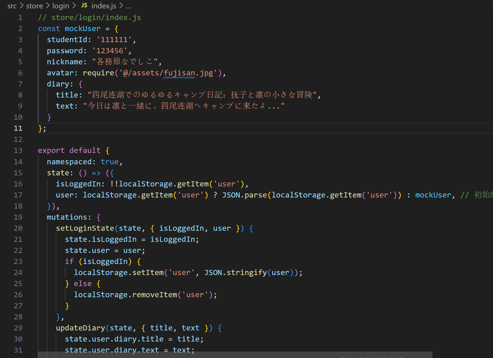
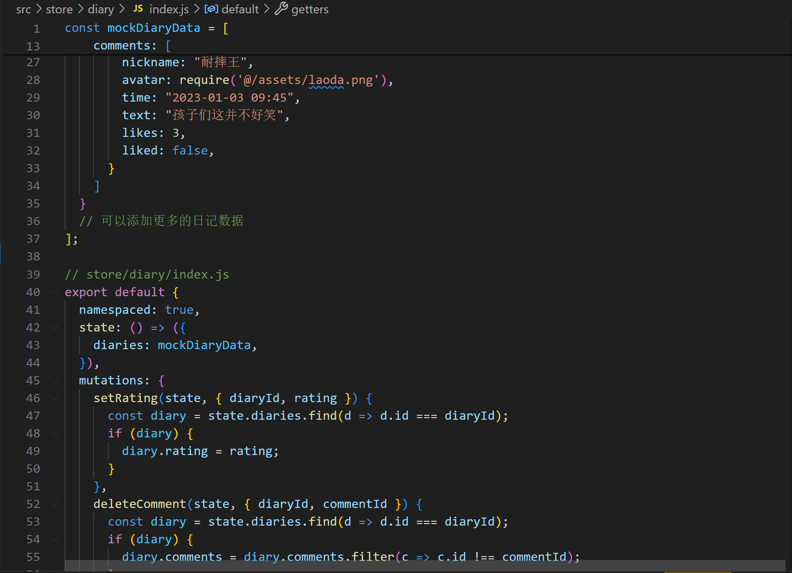

# 第六周周报

| 组号  |    班级    |  姓名  |    学号    |
| :---: | :--------: | :----: | :--------: |
|  27   | 2022211305 | 胡宇杭 | 2022212408 |
|  27   | 2022211305 |  孟林  | 2022210484 |
|  27   | 2022211305 | 陈炳璇 | 2022211479 |

## 第六周周报前端部分

本周已经完成的组件和功能: 

#### 1. 详情地图查询功能
我们的项目中采用了Leaflet这一地图库来完成地图的展示以及地点的标注工作。通过这一技术，我们能够实现以下功能：

1. **数据获取与展示**：我们能够从Vuex中提取预设的点位信息。这些静态数据随后被精确地摆放于地图上，使得用户可以直观地看到各个地点的分布。

2. **交互性增强**：当用户在地图上点击某个图标时，地图下方会出现一个多选框。用户可以通过勾选这个多选框来选择他们感兴趣的地点类型。

3. **智能排序功能**：一旦用户选择了感兴趣的地点类型，并且在地图上点击了某个特定的图标，系统就会自动计算出该点与其它已选择类型地点之间的距离。所有这些地点随后会按照距离的远近进行排序，从而为用户提供从近到远的地点列表。

这样的设计不仅提升了用户与地图之间的交互体验，也使得信息的获取更为直观和便捷。我们利用Leaflet地图库的强大功能，结合Vuex进行数据管理，成功地实现了一个既直观又功能丰富的地图展示系统。

#### 2. 日记部分
关于日记模块的前端开发部分，目前的进展已接近完善。具体而言，我们已经实现了如下核心功能：

1. **路由配置**：为了提供流畅的用户体验，我们已经完成了日记模块的大部分路由设置。这一配置确保了用户在应用内的各种交互（如查看不同页面和执行特定操作）时能够顺畅进行。

2. **日记搜索功能**：用户可以利用搜索栏来查找特定的日记条目。输入日记名后，系统会即时展示出搜索结果，使用户能够快速找到他们感兴趣的内容。

3. **推荐日记展示**：在应用的首页，我们特别设计了一个区域用于展示推荐日记。这些推荐内容会根据用户的阅读偏好和历史活动进行智能推荐，从而提升用户的体验和应用的互动性。

4. **日记详情页面**：当用户点击某个日记时，他们将被引导至该日记的详细页面。在这一页面上，用户不仅可以阅读日记的全文，还可以执行如点赞、评论和打星等互动功能。这些功能旨在增加用户的参与度，鼓励更多的互动交流。

日记模块的前端部分已经通过精心的设计和开发，提供了一系列的用户交互功能，从而极大地丰富了用户的使用体验。我们会继续关注用户的反馈，并根据需要进行进一步的优化和迭代。

### 下周规划
①实现地图首页界面
②做好登录和首页界面的优化并做好路由
③完成日记模块的功能

## 后端部分

### 谢罪：由于上周忘了这周清明节假期等，导致预定计划没有完成

由于之前数据库的开发没有进行完整的计划、设想，开发中需要频繁的更改之前写好的模块，导致包括但不限于 BUG 频出、模块之间的耦合度太高等问题，尤其是进行 *B+Tree* 节点删除工作时，故痛定思痛重新阅读了 *SQLITE* 的源码并对整个数据库重新进行了设计，下周开工。

具体如下所示

### 数据库基本模块：

本项目将基于 SQLITE 给出的数据库架构进行编写，基本模块如下

|     模块     |                      功能                      |
| :----------: | :--------------------------------------------: |
|  Interface   |              提供与外界交流的接口              |
|  Processor   |            处理输入流、解析执行命令            |
|   CoreData   | 定义 Table, Page, Row 数据结构并提供相应的操作 |
|      IO      |       接受输入流、负责数据库加载和持久化       |
| CacheManager |              管理数据库的缓存数据              |
|  Operation   |           提供对数据库进行操作的方法           |
|  Exception   |                  负责异常处理                  |
|    Utils     |           提供公共函数、类（B树等）            |

具体如下

#### Interface

1. 提供控制台版本的 *META COMMAND* 及 增删查改的基本操作指令
2. 提供 CPP 版本的函数接口

具体开放接口会根据项目需求动态调整，之后可能会做更全面的版本

#### Processor

1. Parser 类：
    - 实现对操作指令的 Tokenize
    - 实现对 Tokenized 的语句的 parse，并将结果传递给 Executor 类进行执行
2. Executor 类：
    - 调用相应的接口实现操作指令

#### CoreData

目前预想支持的数据类型有以下几种：

| 数据类型 | 对应 CPP 类型 | 占用空间(Byte) |                 用途                 |
| :------: | :-----------: | :------------: | :----------------------------------: |
|   int    |    int32_t    |       4        | 存储小体量的信息，如点赞数、浏览数等 |
|   real   |    double     |       8        |    存储地图的位置信息、景点评分等    |
|   text   |   char[32]    |       32       |         存储用户姓名、密码等         |
|  text64  |   char[64]    |       64       |     存储用户日记的文件所在位置等     |

1. Row 类：
    - 实际存储单元，在数据库建立时确立
    - 存储主键及由上述数据类型组成的列
    - 负责自身数据的更新
2. Page 类：
    - 一个 *Page* 类中存储多行 *Row*，具体行数由规定 *Page* 的大小、单个 *Row* 的大小共同决定
    - 存储当前页的信息和 *Row* 指针数组
3. Table 类：
    - 存储当前数据库的所有属性，包括数据库的 *ID*，名称、数据存储路径、*Page* 的大小、*Row* 的大小、索引位置、主键类型等
    - 提供增删改查的操作
    - 对 *B+Tree* 的维护
4. Pager 类：
    - 该类是 SQLITE 模型中的一部分，但考虑到我们直接使用 *B+Tree* 维护数据，是否再封装一层在实际开发中综合考虑后决定

#### IO

1. InputStream 类：
    - 读取控制台的输入并传入 *Processor* 进行处理
2. DiskAccessor 类（好吧我承认我取名的水平是依托答辩）：
    - 负责数据库 *BalanceTree* 的读取、存储
    - 负责将需要访问的 *page* 加载到内存中

#### CacheManager:

1. CacheManager 类：
    - 实现对载入内存中的数据的动态管理，旨在进一步减小与磁盘间的 *IO* 交互
    - 实现对载入内存中的数据的持久化（考虑使用多线程技术）

#### Utils

1. BalanceTree 类：（B+Tree）
    - 该类为数据库的核心存储逻辑实现
    - 出于简化考虑，我们假设其所占的内存空间极少（在小规模数据量的情况下），所以我们在数据库打开的时候直接将上层索引结构全部读入内存中
    - 内部节点存储指向父节点的指针数组、指向子节点的指针数组以及主键信息
    - 叶子结点存储指向父节点的指针数组、对应磁盘页的偏移量以及主键信息
    - 对于读取到的数据，我们会参照 *SQL* 的事务系统，将其放入一块缓冲区中，并通过上述 *CacheManager* 类对其进行管理
2. Cursor 类：
    - 介于 Executor 和 Table 间的抽象类，负责与 Table 的交互
    - 对 Parser 传来的语句进行进一步的解析、并根据结果在 Table 中查找到对应的位置

### 后端第七周任务计划

- [ ] 实现基本的 *Row*、*Page*、*table* 类
- [ ] 实现 InputStream 模块
- [ ] 实现 Processor 模块
- [ ] 实现 *B+Tree* 的搜索
- [ ] 实现 *B+Tree* 叶子结点的插入
- [ ] 实现 *B+Tree* 插入时节点的分裂逻辑