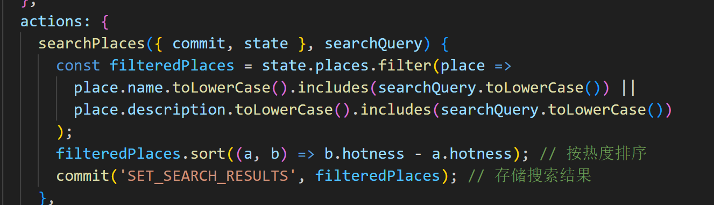
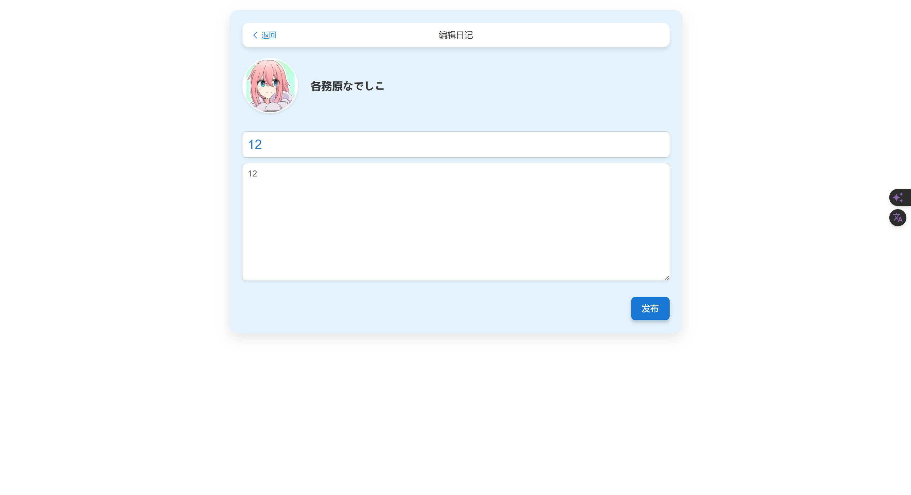

# 第六周周报

| 组号  |    班级    |  姓名  |    学号    |
| :---: | :--------: | :----: | :--------: |
|  27   | 2022211305 | 胡宇杭 | 2022212408 |
|  27   | 2022211305 |  孟林  | 2022210484 |
|  27   | 2022211305 | 陈炳璇 | 2022211479 |

## 第七周周报前端部分

### 概述
在过去的一周中，我们的前端开发团队成功实现了几个关键的功能点，这些进展标志着我们在提升用户体验和界面互动性方面迈出了重要步伐。我们完成了日记模块的全流程开发，包括路由的优化、导航逻辑的精细化调整以及界面的美观设计。

### 详细进展

#### 1. 日记首页的全新体验
本周，我们对日记首页进行了全面的更新，使其能够根据日记的“热度”来进行内容展示。这一“热度”指标是通过一种精密的算法计算出来的，该算法考虑了日记的点赞数量、用户评分以及评论数量等多个因素。此外，我们还引入了一项新功能：删除日记。这使得用户能够更好地管理自己的内容，提高了应用的个性化和安全性。现在，用户在首页点击任何一个日记条目，都会被引导到该日记的详细页面，其中不仅展示了日记的全文内容，还包括了评论区及点赞和打分功能，极大地增强了用户互动。



#### 2. 日记详情页的功能增强
在日记详情页上，我们增加了更多互动元素，用户不仅可以查看日记的发布时间和具体内容，还可以进行点赞、评论和打分等操作。特别地，我们新增了用户可以删除自己评论的功能，这一改进为用户提供了更大的控制权和自由度，使得互动更加自然和方便。


#### 3. 日记编辑界面的优化
从用户反馈来看，日记编辑界面的便捷性是大家非常关注的一点。本周，我们对此进行了优化。现在用户通过点击首页右下角的“编辑日记”按钮后，会进入一个界面友好、操作直观的编辑页面，用户可以在此轻松输入日记的标题和内容。发布日记后，系统设计了自动跳转机制，直接将用户带回到主页，并即时展示出新发布的内容，这种无缝的操作流程大幅提升了用户的使用满意度。



#### 4. 页面的视觉设计提升
为了使用户在浏览和使用过程中得到更好的视觉体验，我们选择了天蓝色和白色作为主要的页面色彩。这种颜色搭配不仅使页面看起来更加清新、舒适，还有助于提高内容的可读性。我们在设计上进行了精细的布局调整，确保按钮和组件的摆放既美观又实用，页面整体展现了现代化和优雅的风格，极大地提升了界面的一体化和专业感。

#### 5. 下周的工作预告
展望未来，我们计划继续扩展前端的功能。下周，我们将开始设计网站的主页，该主页将展示按热度排序的景点，每个景点会附带位置信息、详细描述和预览图片等。我们的目标是通过提供丰富的视觉内容和详细信息，来增强用户的浏览体验和互动性。

### 总结
通过本周的工作，我们在前端开发方面取得了实质性的进展。我们不仅优化了用户的互动体验，还提升了界面的视觉效果。

## 后端部分

~~本周由于被大床带队研究生疯狂push，导致进度并未达到预期~~
本周完成了数据库方面整体框架的构建、*PrimeKeyType*、*Row* 类的编写以及 *Page* 类的定义，具体如下：


### META_DATA

#### DATA_TYPE
定义枚举类型 DATA_TYPE，表示数据库支持的数据类型

```cpp
enum DATA_TYPE : uint16_t
{
    _INT,       // int32_t      
    _REAL,      // double
    _TEXT,      // char[32]
    _TEXT64     // char[64]
};

#define TEXT_LENGTH 32
#define TEXT64_LENGTH 64
```

其中，除 *_TEXT64* 以外都可当作主键类型

#### DATA

```cpp
union Data
{
    int32_t i_int;      // _INT
    double d_double;    // _REAL
    char t_text[32];    // _TEXT
};
```

使用 *union* 语句定义 *data* 的类型，项目之初考虑过使用 *std::variant* 实现更安全的联合语法，但考虑到运行效率等因素,~~主要是*std::variant* 不支持数组，导致定义 *text* 类型非常麻烦，还要包一层 *std::array*，而且访问也要写一大串~~，最终考虑使用更底层的 *union* 实现

### PrimKeyType

```cpp
class PrimKeyType
{
  public:
    DATA_TYPE dataType; // Prime key type
    Data data;          // Prime key value

    PrimKeyType();      // Default Constructor, with a default type _TEXT
    PrimKeyType(std::string param, DATA_TYPE type);
    explicit PrimKeyType(DATA_TYPE type);               // Construct with a data type and default val 0
    explicit PrimKeyType(int32_t param);                // Construct with a _INT value
    explicit PrimKeyType(double_t param);               // Construct with a _REAL value
    explicit PrimKeyType(std::string param);            // Construct with a _TEXT value
    void modifyValue(void* value, DATA_TYPE type);      // Update value & type

    bool operator< (const PrimKeyType& type) const;
    bool operator<= (const PrimKeyType& type) const;
    bool operator> (const PrimKeyType& type) const;
    bool operator>= (const PrimKeyType& type) const;
    bool operator== (const PrimKeyType& type) const;
    friend std::ostream& operator<< (std::ostream& os, PrimKeyType& type);
};
```

*PrimKeyType* 类将 *DATA_TYPE*与 *Data* 封装在一起来描述主键的信息（类型、值），同时提供多种构造函数（后续根据需求可能会继续添加），以及更新函数，并且对运算符进行了重载，重载逻辑为先辨别主键类型是否一致，在按照 cpp 的类型比较逻辑进行比较

在第二个构造函数中，我们的值是通过 *std::string* 传入的，在函数内，我们首先通过 *paramCheck* 函数确定传入值的类型
```cpp
void paramCheck(const std::string& param, const DATA_TYPE type)
{
    if (param.empty()) {
        throw PARAM_EMPTY;
    }

    // TODO: recognise double with E expression
    switch (type) {
        case _INT:
            if (!std::regex_match(param, std::regex("^-?\\d+"))) {
                throw TYPE_INT_MISMATCH;
            }
            break;
        case _REAL:
            if (!std::regex_match(param, std::regex("^-?\\d+\\.\\d+")) &&
                !regex_match(param, std::regex("^-?\\d+"))){
                throw TYPE_REAL_MISMATCH;
            }
            break;
        case _TEXT:
            if (param.length() >= TEXT_LENGTH) {
                throw TYPE_TEXT_MISMATCH;
            }
            break;
        case _TEXT64:
            if (param.length() >= TEXT64_LENGTH) {
                throw TYPE_TEXT64_OVERFLOW;
            }
            break;
    }
}
```
通过 cpp 的 *std::regex* 正则表达式语句，我们可以很轻松的得出传入字符串所代表的类型，目前尚未实现对科学计数法表示的 *double* 类型的辨别，同时对非法情况抛出对应的异常，异常表仍在编写完善中，这里不做展示

```cpp
PrimKeyType::PrimKeyType(std::string param, DATA_TYPE type)
{
    memset(&data, 0, sizeof(Data));
    paramCheck(param, type);

    dataType = type;
    switch (type) {
        case _INT:
            try {
                data.i_int = std::stoi(param);
            } catch (std::out_of_range& e) {
                throw TYPE_INT_OVERFLOW;
            }
            break;
        case _REAL:
            try {
                data.d_double = std::stod(param);
            } catch (std::out_of_range& e) {
                throw TYPE_REAL_OVERFLOW;
            }
            break;
        case _TEXT:
            strcpy(data.t_text, param.c_str());
            break;
        case _TEXT64:
            throw PRIME_KEY_TYPE_INVALID;
        default:
            // _TEXT64 is not allowed to be the primKey
            throw TYPE_UNDEFINED;
    }
}
```

然后判断和传入的类型是否一致，并做相应处理

### Row

```cpp
class Row
{
  private:
    // Row head, store the info of primKey
    PrimKeyType rowKey;

    // Row body, store each column
    void** contents;

    // Ptr to get param info etc.
    Table* tablePtr;

  public:
    Row(Table* table);      // Constructor need a Table class to initialize the columns it contains
    void setContents(const std::vector<std::string>& conditions, const std::vector<std::string>& values);
    [[nodiscard]] std::string getValue(uint32_t position) const;
    [[nodiscard]] std::string getValue(const std::vector<uint32_t>& positions) const;
    void modifyValue(uint32_t position, const std::string& value);
    void modifyValue(const std::vector<uint32_t>& positions, const std::vector<std::string>& values);
    void modifyKey();
    void clear();

    bool operator< (const Row& row) const;
    bool operator> (const Row& row) const;
    bool operator<= (const Row& row) const;
    bool operator>= (const Row& row) const;
    bool operator== (const Row& row) const;
    friend std::ostream& operator<< (std::ostream& os, const Row& row);
};
```

在 *Row* 的定义中，对于每一行，都有其自己的主键和列，分别对应 *rowKey* 和 *contents*，其中 *contents* 是一个二维数组，指向每一列，最后，我们定义了 *tablePtr* 指向包含该行的表，用来获取列名、列数等信息

函数的实现在此不做赘述，最后可能会集成到项目文档中，在末尾会贴上代码

### 后端下周目标

由于下下周要其中考试，下周的进度会稍作减缓，目标完成上周目标除 B+ 树编写的部分，并且完成 *Cursor* 类的编写

### Row 代码实现

#### setContents
```cpp

/*
 * Row Operations
 */

void Row::setContents(const std::vector<std::string>& conditions, const std::vector<std::string>& values)
{
    try {
        if (values.empty()) {
            throw PARAM_EMPTY;
        }

        auto paramNum = tablePtr->numParams;
        if (conditions.empty() && values.size() == tablePtr->numParams) {
            // we assume that conditions vector being empty stands for set all columns
            modifyValue(std::vector<uint32_t>(), values);
            modifyKey();
            return;
        }

        if (conditions.size() != values.size() ||
            conditions.size() > paramNum ||
            values.size() < paramNum) {
            throw PARAM_MISMATCH;
        }

        if (std::find(conditions.begin(),conditions.end(),
                      tablePtr->getPrimKeyName()) == conditions.end()) {
            throw PRIME_KEY_REQUIRED;
        }

        auto size = conditions.size();
        for (int i = 0; i < size; i ++ ) {
            int32_t pos = tablePtr->paramFind(conditions[i]);
            if (pos == -1) {
                throw PARAM_NOT_FOUND;
            }
            modifyValue(pos, values[i]);
        }
        modifyKey();
    } catch (std::exception& e) {
        throw SYSTEM_ERROR;
    }
}
```

#### modifyValue
```cpp
void Row::modifyValue(const uint32_t position, const std::string& value)
{
    try {
        auto& type = tablePtr->typeParams[position];
        auto& oldVal = contents[position];
        paramCheck(value, type);

        switch (type) {
            case _INT:
                try {
                    *((int*)oldVal) = std::stoi(value);
                } catch (std::out_of_range& e) {
                    throw TYPE_INT_OVERFLOW;
                }
                return;
            case _REAL:
                try {
                    *((double*)oldVal) = std::stod(value);
                } catch (std::out_of_range& e) {
                    throw TYPE_REAL_OVERFLOW;
                }
                return;
            case _TEXT:
                strcpy((char*)oldVal, value.c_str());
                return;
            case _TEXT64:
                strcpy((char*)oldVal, value.c_str());
            default:
                throw TYPE_UNDEFINED;
        }
    } catch (std::exception& e) {
        throw SYSTEM_ERROR;
    }

}
```

#### modifyValue 重载版本（接受多个输入）
```cpp
void Row::modifyValue(const std::vector<uint32_t>& positions, const std::vector<std::string>& values)
{
    // TODO: Implement checking  if two containers' size are same in higher level
    auto numParams = tablePtr->numParams;
    if (positions.empty() && values.size() == tablePtr->numParams) {
        for (int i = 0; i < numParams; i ++ ) {
            modifyValue(i, values[i]);
        }
        return;
    }

    auto size = positions.size();
    for (int i = 0; i < size; i ++ ) {
        modifyValue(positions[i], values[i]);
    }
}
```

#### modifyKey
```cpp
void Row::modifyKey()
{
    rowKey.modifyValue(contents[tablePtr->primKey], tablePtr->getPrimKeyType());
}
```

#### getValue
```cpp
std::string Row::getValue(const uint32_t position) const
{
    std::string result = "";
    auto& type = tablePtr->typeParams[position];
    auto& value = contents[position];

    switch (type) {
        case _INT:
            result += std::to_string(*((int*)value));
            break;
        case _REAL:
            result += std::to_string(*((double*)value));
            break;
        default:
            result += (char*)value;
            break;
    }

    return result;
}
```

#### getValue 重载版本（接受多个输入）

```cpp
std::string Row::getValue(const std::vector<uint32_t>& positions) const
{
    std::string result = "";
    auto& types = tablePtr->typeParams;
    auto& paramNum = tablePtr->numParams;
    auto& values = contents;

    if (positions.empty()) {
        // we assume that vector being empty stands for selecting all columns
        for (int i = 0; i < paramNum; i ++ ) {
            result += getValue(i) + (i == paramNum - 1 ? "" : ",");
        }
    } else {
        // iterate through the container to get columns' values
        for (auto it = positions.begin(); it != positions.end(); it ++ ) {
            result += getValue(*it) + (std::next(it) == positions.end() ? "" : ",");
        }
    }

    return result;
}
```

#### clear

```cpp
void Row::clear()
{
    auto& paramNum = tablePtr->numParams;

    for (int i = 0; i < paramNum; i ++ ) {
        auto& value = contents[i];
        auto type = tablePtr->typeParams[i];
        if (value == nullptr) continue;

        switch (type) {
            case _INT:
                delete (int*)value;
                break;
            case _REAL:
                delete (double*)value;
                break;
            case _TEXT: case _TEXT64:
                delete (char*)value;
                break;
        }
        value = nullptr;
    }
    delete[] contents;
    contents = nullptr;
    tablePtr = nullptr;
}
```