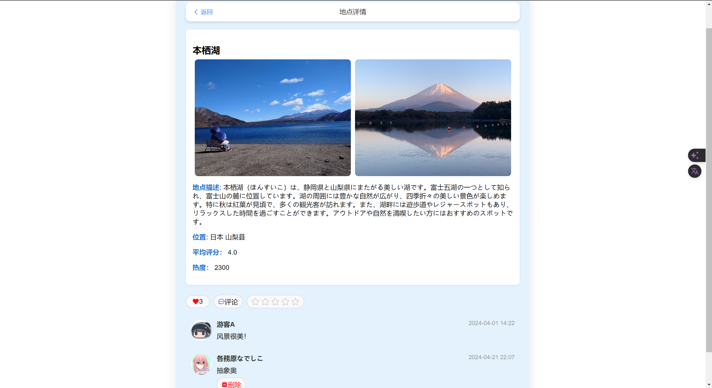

# 第八周周报前端部分

### 概述
在过去的一周中，我们的前端开发团队取得了显著的进步，成功实现了多个关键功能，进一步提升了用户体验和界面互动性。特别地，我们完成了日记模块的全流程开发，涵盖了路由优化、导航逻辑的细化以及界面的美观设计。

### 详细进展

#### 1. 游学系统首页的全新体验
本周，日记首页经历了一次全面的更新，现在能够根据日记的“热度”展示内容，这种热度是通过一个考虑了点赞、用户评分及评论数量的复杂算法计算得出的。新增的删除功能让用户能更好地管理自己的日记，提升了应用的个性化和安全性。用户现在可以从首页直接进入任何日记的详细页面，这不仅显示了完整日记内容，还包括了互动丰富的评论区以及点赞和打分功能。

#### 2. 游学系统详情页的功能增强
详情页新增了多种互动元素，用户可以查看日记的发布时间、内容，并参与点赞、评论和打分。特别新增的功能允许用户删除自己的评论，这提供了更大的控制权和自由度，使互动变得更自然和方便。

#### 3. 页面的视觉设计提升
我们继续选择了天蓝色和白色作为主页面色彩，使页面不仅看起来更加清新舒适，还提高了内容的可读性。界面布局经过精细调整，确保了按钮和组件的美观与实用性，页面的现代化和优雅风格显著提升了界面的一体化和专业感。

#### 4. 下周的工作预告
展望未来，我们计划继续扩展前端的功能。下周，我们将开始设计网站的主页，该主页将展示按热度排序的景点，每个景点会附带位置信息、详细描述和预览图片等。我们的目标是通过提供丰富的视觉内容和详细信息，来增强用户的浏览体验和互动性。

### 总结
本周的工作使我们在前端开发方面取得了重要进展，不仅优化了用户的互动体验，还显著提升了界面的视觉效果。我们期待持续推动项目发展，确保应用能够满足用户的需求并提供卓越的服务。