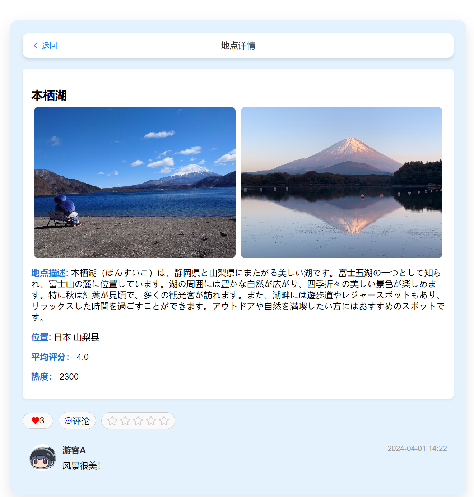
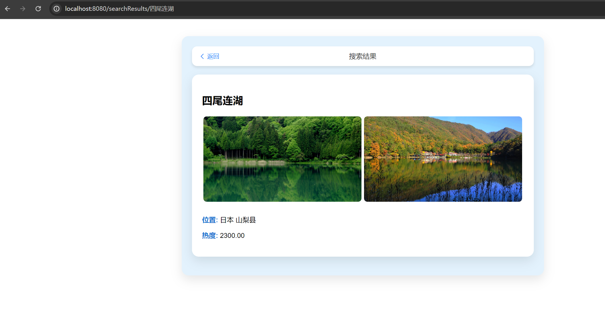

# 第九周周报前端部分

### 概述
在过去的一周中，我们的前端开发团队集中精力对网站的关键功能进行了深入优化，尤其是在提升景点展示的互动性和易用性方面取得了重大进展。这些更新的目的是为了极大地提升用户体验，确保用户在获取和浏览信息时更加便捷和顺畅。

### 详细进展

#### 1. 按热度展示景点
在本周，我们团队完成了一个重要的新功能，即按照热度顺序展示景点的功能。这一功能的背后是一个复杂的算法，该算法根据用户的互动行为，如点赞、评论和页面浏览次数等因素来计算每个景点的热度。此功能的实施使得用户可以快速地识别出哪些景点最受欢迎，从而更有效地进行他们的浏览规划和旅行安排。

#### 2. 图片预览功能
我们新增了一个点击图片即可预览的功能，现在用户可以通过简单地点击景点列表中的图片，迅速查看大图预览。这项功能的加入为用户提供了一种更加直观的方式来查看景点的详细视觉内容，极大地增强了用户在浏览时的视觉体验和满意度。

#### 3. 基于关键字的搜索功能
我们对搜索功能进行了显著增强，现在用户可以通过输入特定的关键字来搜索与这些关键字匹配的景点内容和描述。这些搜索结果会按照景点的热度顺序进行排序展示，确保用户能够立即发现最相关且受欢迎的景点信息。这项改进极大地提升了网站的功能性和用户的搜索效率，使得用户能够更快找到他们需要的信息。

#### 4. 下周的工作预告
展望未来，我们计划在继续优化前端功能的同时，特别是提升网站的响应速度和交互设计方面做出更多努力。在接下来的一周中，我们将专注于提升网站的加载速度和优化用户界面的动态交互效果，目标是为用户提供一个更为流畅和引人入胜的使用体验。

### 总结
通过本周的不懈努力，我们在增加新功能和优化现有服务方面取得了显著成果，显著提升了用户界面的功能性和互动性。我们的开发团队将继续致力于提高网站的性能和用户满意度，确保为用户提供一个高效、便捷和愉悦的在线浏览环境。我们期待未来几周内能持续报告更多的正向进展。