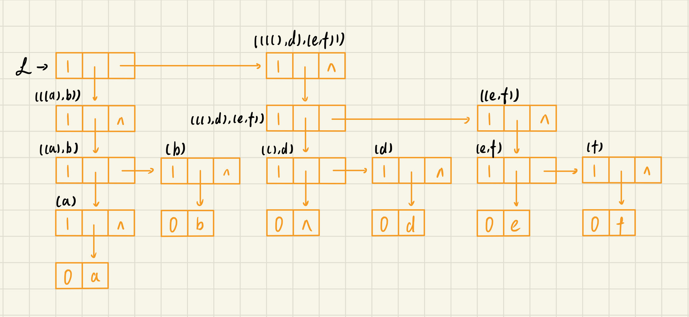

1、 假设有二维数组 $A_{6*8}$，每个元素用相邻的 $6$ 个字节存储，存储器按字节编址。已知A的起始存储位置为 $1000$，计算：
a. 数组 $A$ 的体积（即存储量）；
  > $6 * 8 * 6 = 288$ 字节

  b. 数组 $A$ 的最后一个元素 $a_{57}$ 的第一个字节的地址；
  > $LOC[5, 7] = LOC[0, 0] + 5 * 8 * 6 + 7 * 6 = 1000 + 5 * 8 * 6 + 7 * 6 = 1282$

  c. 按行存储时（低下标优先），元素 $a_{14}$ 的第一个字节的地址；
  > $LOC[1, 4] = LOC[0, 0] + 1 * 8 * 6 + 4 * 6 = 1000 + 1 * 8 * 6 + 4 * 6 = 1072$

  d. 按列存储时（高下标优先），元素 $a_{47}$ 的第一个字节的地址。
  > $LOC[4, 7] = LOC[0, 0] + 7 * 6 * 6 + 4 * 6 = 1000 + 7 * 6 * 6 + 4 * 6 = 1276$

2、 假设按低下标优先存储整数数据 $A_{9*3*5*8}$ 时，第一个元素的字节地址是 $100$，每个整数占四个字节。问元素 $a_{1111} , a_{3125}$ 的存储地址分别是什么？
> $LOC[1, 1, 1, 1] = LOC[0, 0, 0, 0] + c_1j_1 + c_2j_2 + c_3j_3 + c_4j_4 = 100 + 3 * 5 * 8 * 4 * 1 + 5 * 8 * 4 * 1 + 8 * 4 * 1 + 4 * 1 = 100 + 480 + 160 + 32 + 4 = 776$
> $LOC[3, 1, 2, 5] = LOC[0, 0, 0, 0] + c_1j_1 + c_2j_2 + c_3j_3 + c_4j_4 = 100 + 3 * 160 * 3 + 5 * 32 * 1 +  8 * 4 * 2 + 4 * 5 = 1784$

3、 设有上三角矩阵 $(a_{ij})_{n*n}$，将其上三角元素逐行存储在数组 $B[m]$ 中（m充分大），使得 $B[k]=a_{ij}$ 且 $k=f_1(i)+f_2(j)+c$。试写出函数 $f_1,f_2$ 和常数 $c$。
> $f_1(i) = (i - 1)\frac{2n - i + 2}{2} - i$
> $f_2(j) = j$
> $c = 1$

4、 设有三对角矩阵 $(a_{ij})_{n*n}$，将其三条对角线上的元素逐行存于数组 $B[3n-2]$ 中，使得 $B[k]=a_{ij}$，求用 $i, j$表示 $k$ 的下标变换公式，以及用 $k$ 表示 $i, j$ 的下标变换公式。
> 设 $i, j$ 从 $1$ 开始
> $k = 2i + j - 3$
> $i = \lfloor\frac{k + 1}{3} + 1\rfloor$，$j = k - 2i + 3$

5、 广义表的 $GetHead$ 和 $GetTail$ 操作分别记做 GetHead【】，GetTail【】
  a. 写出 GetHead【GetTail【GetHead【((a,b),(c,d))】】】的结果。
  > b

  b. 写出 GetTail【GetHead【GetTail【((a,b),(c,d))】】】的结果。
  > d

  c. 参照上面两个例子写出从广义表 $L1、L2$ 中利用一系列 $GetHead、GetTail$ 操作取出原子项 $banana$ 的方法。
    i） L1 = ((((apple))),((pear)),(banana),orange);
> 1 GetTail[((((apple))),((pear)),(banana),orange)] = (((pear)),(banana),orange)
> 2 GetTail[(((pear)),(banana),orange)] = ((banana),orange)
> 3 GetHead[((banana),orange)] = (banana)
> 4 GetHead[(banana)] = banana

ii） L2 = (apple,(pear,(banana),orange));
> 1 GetTail[(apple,(pear,(banana),orange))] = ((pear,(banana),orange))
> 2 GetHead[((pear,(banana),orange))] = (pear,(banana),orange)
> 3 GetTail[(pear,(banana),orange)]= ((banana),orange)
> 4 GetHead[((banana),orange)] = (banana)
> 5 GetHead[(banana)] = banana

6、 画出广义表$((((a),b)),(((),d),(e,f)))$的存储结构，并求它的深度。
> 深度为 $4$

