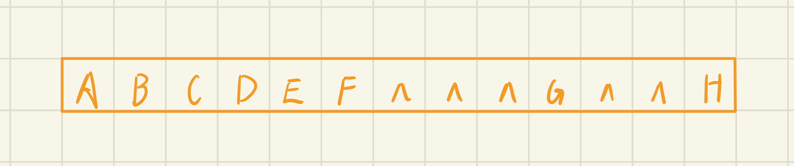
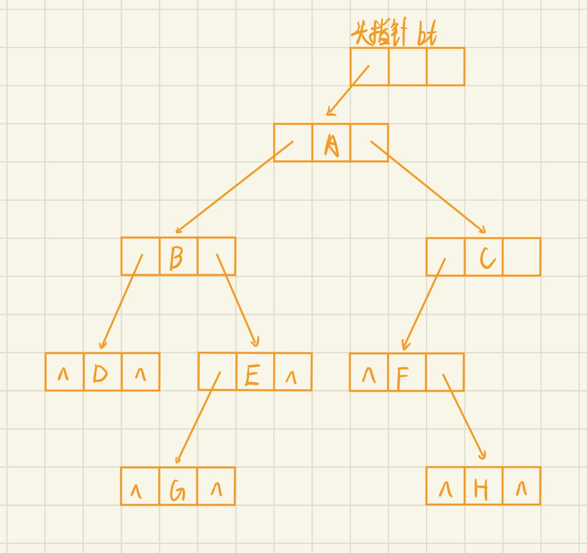
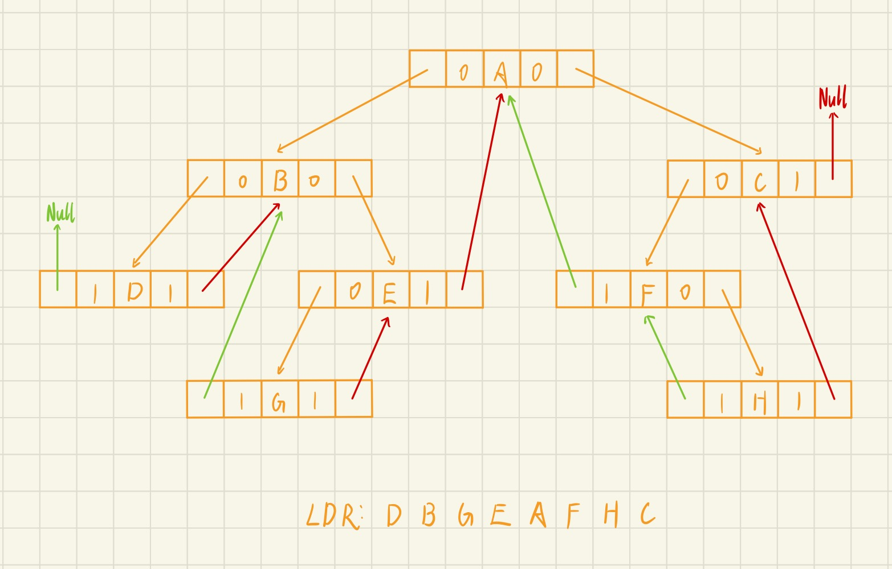
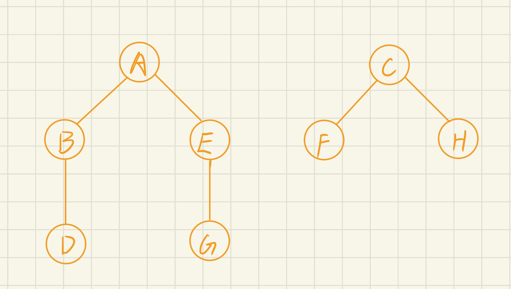

# 一、选择题

1. 下列说法正确的是（   *C*   ）
 A. 二叉树中的任何一个结点的度为2 
 B. 二叉树的度为2
 C. 一颗二叉树的度可小于2 
 D. 任何一颗二叉树中至少有一个结点的度为2
2. 以二叉链表作为二叉树的存储结构，在具有n个结点的二叉链表中，空指针域的个数为（   *C*   ）
 A. 2n-1      B. n-1         C. n+1         D. 2n+1
3. 如果结点A有3个兄弟，而且B是A的双亲，则B的度为（   *B*   ）
 A. 3           B.      4        C. 5             D. 1
4. 某二叉树T有n个结点，设按某种顺序对T中的每个结点进行编号，编号值为1,2……n。如果有如下性质：T中任意结点v，其编号等于左子树上的最小编号减1，而v的右子树的结点中，其最小编号等于v左子树上结点的最大编号加1，则这是按（     *B*    ）编号的。
 A. 中序遍历序列       B. 先序遍历序列        C. 后序遍历序列         D. 层次遍历序列
5. 设F是一个森林，B是由F转换得到的二叉树，F中有n个非终端结点，B中右指针域为空的结点有（    *C*     ）个
   A. n-1           B. n               C. n+1           D. n+2
6. 一颗完全二叉树上有1001个结点，其中叶子结点的个数是（    *B*     ）
   A. 500           B. 501          C. 490           D. 495
7. 对于一个有N个结点、K条边的森林，共有几棵树？  （     *A*     ）
   A. N−K       B.N−K+1            C.N−K−1       D.不能确定
8. 设森林F中有三棵树，第1、第2和第3棵树的结点个数分别为N1，N2,和N3。与森林F对应的二叉树根结点的右子树上的结点个数是（   *D*   ）
    A. N1            B. N1+N2      C.N2         D. N2+N3
9. 任何一棵二叉树的叶子结点在先序、中序、后序遍历序列中的相对次序（    *A*     ）
   A. 不发生改变       B. 发生改变          C. 不确定 
10. 若一棵二叉树的后序遍历序列为dabec,中序遍历序列为debac, 则先序遍历序列为（    *D*     ）
   A. cbeda               B. decab             C. deabc        D. cedba
11. 一棵非空二叉树的先序遍历序列与后序遍历序列正好相反，则该二叉树一定满足（    *C*     ）
 A. 所有的结点均无左孩子        B. 所有的结点均无右孩子
 C.只有一个叶子结点                D. 是一棵满二叉树
12. 对 n 个互不相同的符号进行哈夫曼编码。若生成的哈夫曼树共有 115 个结点，则 n 的值是（   *C*   ）
  A.56        B.57         C.58       D.60

# 二、判断题

1. 由树转换成二叉树，其根结点的右子树总是空的（    $\surd$    ）
2. 完全二叉树中，若一个结点没有左孩子，则它必是叶子结点（    $\surd$    ）
3. 若一个结点是某二叉树子树的中序遍历序列中的第一个结点，则它必是该子树的后序遍历序列中的第一个结点（   *X*  ）
4. 对一棵二叉树进行层次遍历时，应借助一个栈（    *X*   ）
5. 完全二叉树可采用顺序存储结构实现，非完全二叉树则不能（    *X*    ）

# 三、简答题
1. 一棵度为2的树与一棵二叉树有何区别？
> 度为 2 的树虽然也是最多有两个子结点，但并不区分左右；度为 2 的树至少得有 3 个结点，而二叉树的结点数只要大于等于 0 即可

2. 一棵深度为H的满k叉树有如下性质：第H层上的结点都是叶子结点，其余各层上每个结点都有k棵非空子树。如果按层次顺序从1开始对全部结点编号，问：
  1. 各层的结点数目是多少？
  > 第 *i* 层的结点数为 $k^{i - 1}$

  2. 编号为p的结点的父结点的编号是多少？
  > $\lceil \frac{p - 1}{k} \rceil$

  3. 编号为p的结点的第i个孩子结点（若存在）的编号是多少？
  > $(p-1)k + 1 + i$

  4. 编号为p的结点有右兄弟的条件是什么？其右兄弟的编号是多少？
  > $(p - 1) \% k \ne 0$，$p + 1$

3. 对于下图所示的二叉树，请画出
  1. 顺序存储结构
  

  2. 二叉链表存储结构
  

  1. 二叉中序线索结构
  
  1. 将本叉树转换成相应的森林
  


4. 假设用于通信的电文由字符集{a,b,c,d,e,f,g}中的字母构成，他们在电文中出现的频度分别为{0.31,0.16,0.10,0.08,0.11,0.20,0.04}
  1. 请为这7个字母设置哈夫曼编码
  > a: 01 
    b: 001
    c: 100
    d: 0001
    e: 101
    f: 11
    g: 0000
  1. 整个哈夫曼树的WPL是多少
  > $WPL = (0.31 + 0.20) * 2 + (0.16 + 0.10 + 0.11) * 3 + (0.08 + 0.04) * 4 = 1.02 + 1.11 + 0.48 = 2.61$

  1. 对这7个字母进行等长编码，至少需要几位二进制数，哈夫曼编码比等长编码使电文总长度压缩了多少？
  > $\lfloor log_27 \rfloor = 3$
    压缩了 $(1 - \frac{2.61}{3}) * 100\% = 13\%$

# 四、算法题

1. 试编写算法，求一棵以孩子-兄弟链表表示的树的叶子的个数。
```
int countLeaf(Btr* t)
{
    if (t == NULL) return 0;

    int res = 0;
    if (t->child == NULL) res ++ ;

    res += countLeaf(t->child);
    res += countLeaf(t->slibing);

    return res;
}
```
2. 试编写算法，求一棵以孩子-兄弟链表表示的树的度。
```
void countDegree(Btr* t, int k, int& ans)
{
    if (t == NULL) return;
    ans = max(ans, k);

    countDegree(t->child, 1, ans);
    countDegree(t->slibing, k + 1, ans);
}
// 函数调用 int ans = 0; countDegree(t, 0, ans);
```
 