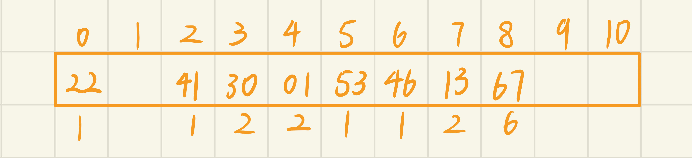

# 一、选择题

1. 在表长为n的顺序表上实施顺序查找，在查找不成功时与关键字比较的次数为（   $C$    ）        
  A. n
  B. 1
  C. n + 1
  D. n - 1  
  
2. 适用于折半查找的表的存储方式及元素排列要求为（     $D$     ）       
  A. 链式存储，元素无序
  B. 链式存储，元素有序 
  C. 顺序存储，元素无序 
  D. 顺序存储，元素有序 

3. 在有序表{1,3,9,12,32,41,62,75,77,82,95,100}上进行折半查找关键字为82的数据元素需要比较（     $B$     ）次       
  A. 1
  B. 2
  C. 4
  D. 5

4. 给定平衡二叉树如下图所示，插入关键字 23 后，根中的关键字是（     $D$     ）

  A. 16
  B. 20
  C. 30
  D. 25
  
5. 下列关于非空 B-树的叙述中，正确的是：（       $B$      ）
  I、 插入操作可能增加树的高度
  II、 删除操作一定会导致叶结点的变化
  III、 查找某关键字总是要查找到叶结点
  IV、 插入的新关键字最终位于叶结点中
  A. 仅 I         
  B. 仅 I、II           
  C. 仅 III、IV                
  D. 仅 I、II、IV

6. B+树不同于B树的特点之一是：(     $A$    )
A. 能支持顺序查找
B. 结点中含有关键字
C. 根结点至少有两个分支
D. 所有叶结点都在同一层上

7. 若每个月要为全市八十岁以上的老人按年龄段发补助，即需要找到这些老人的信息并更新补助发放数据，则以下哪种是最合适的储存全市人口的方式？注意：人口数据每天都在更新。  （     $D$    ）
A.  将居民信息按年龄从大到小存在顺序表里
B.  将居民信息按年龄大小存在一棵平衡的二叉搜索树里
C.  将居民信息按年龄大小存在链表中
D.  将居民信息以年龄为键值存在哈希表里，用平方探测法解决冲突

# 二、简答题
1. 已知含12个关键字的有序表及其相应权值为：

|序号| 1 | 2 | 3 | 4 | 5 | 6 | 7 | 8 | 9 | 10 | 11 | 12 |
|:-:|:-:|:-:|:-:|:-:|:-:|:-:|:-:|:-:|:-:|:-:|:-:|:-:|
|关键字| A | B | C | D | E | F | G | H | I | J | K | L |
|权值| 4 | 6 | 3 | 4 | 9 | 3 | 2 | 6 | 1 | 5 | 3 | 4 | 

 (1) 画出对以上有序表进行折半查找的判定树，求折半查找时查找成功的平均查找长度ASL。

 
 $$ASL = \sum_{i=1}^{12}P_iC_i = \frac{1}{50}[3\times1 + (3+1)\times2 + (4+4+2+3)\times3 + (6+9+6+5+4)\times4] = 3.4$$
 (2) 按次优查找树的构造算法画出次优查找树，并计算平均查找长度ASL。

 
 $$ASL = \sum_{i=1}^{12}P_iC_i = \frac{1}{50}[3\times1 + (3+5)\times2 + (6+9+6+4)\times3 + (4+4+2+1+3)\times4] = 3$$

2. 已知如下长度为12的表：
   (Jan, Feb, Mar, Apr, May, June, July, Aug, Sep, Oct, Nov, Dec)

  (1) 试按表中元素的顺序依次插入一棵初始为空的c，请画出插入完成之后的二叉排序树，并求其在等概率的情况下查找成功的平均查找长度ASL。（关键字按字母表顺序排序，第一个字母相同的，比较第二个字母）

  
  $$ASL = \sum_{i=1}^{12}P_iC_i = \frac{1}{12}(1+2\times2 + 3\times3 + 3\times4 + 2\times5 + 6) = 3.5$$

  (2) 按表中元素的顺序构造一棵平衡二叉排序树，并求其在等概率的情况下查找成功的平均查找长度ASL。

  
  $$ASL = \sum_{i=1}^{12}P_iC_i = \frac{1}{12}(1+2\times2 + 4\times3 + 4\times4 + 5) = \frac{19}{6} \approx 3.17 $$

3. 试从空树开始，画出按以下次序向3阶B-树中插入关键码的建树过程：20，30，50，52，60，68，70。如果此后删除50和68，画出每一步执行后B-树的状态。
  
  #### 建树：
  
  
  
  
  #### 删除：
  
  

4. 选取哈希函数H(k)=(3k) MOD 11。
   试在0~10的散列地址空间中对关键字序列(22, 41, 53, 46, 30, 13, 01, 67)造哈希表，并求等概率情况下查找成功时的平均查找长度和不成功时的平均查找长度以及装填因子。
   (1) 用线性探测开放定址法处理冲突

   
   查找成功：$$ASL = \sum_{i=1}^{8}P_iC_i = \frac{1}{8}(1 + 1 + 1 + 2 + 2 + 1  +1  +2) = 1.375$$ 查找失败 $$ASL = \sum_{i=1}^{8}P_iC_i = \frac{1}{8}(9 + 8 + 7 + 6 + 5 + 4 + 3 + 2 + 1 + 1 + 1) = 5.875$$

   (2) 用链地址法处理冲突

   
   查找成功：$$ASL = \sum_{i=1}^{8}P_iC_i = \frac{1}{8}(6 + 2\times2) = 1.25$$ 查找失败 $$ASL = \sum_{i=1}^{8}P_iC_i = \frac{1}{8}(1+1+2+1+1+2) = 1$$


# 三、算法题

1. 编写一个算法，利用折半查找算法在一个有序表中查找最后一个值小于或等于给定值的元素。
```
int BinarySearch(int a[], int n, int x)
{
    int l = 1, r = n;

    while (l <= r)
    {
        int mid = (l + r) >> 1;

        if (a[mid] <= x)
        {
            if (mid == n || a[mid + 1] > x) return mid;
            else l = mid + 1;
        }
        else r = mid - 1;
    }

    return 0;
} 
```
2.  编写一个算法，利用折半查找算法在一个有序表中插入一个元素x，并保持表的有序性。
```
void BinaryInsert(int a[], int n, int x)
{
    if (n + 1 == a.length()) return;

    int l = 1, r = n, pos = 0;

    while (l <= r)
    {
        int mid = (l + r) >> 1;

        if (a[mid] <= x)
        {
            if (mid == n || a[mid + 1] > x)
            { 
                pos = mid;
                break;
            }
            else l = mid + 1;
        }
        else r = mid - 1;
    }
    
    for (int i = n; i > pos; i -- ) a[i + 1] = a[i];
    a[pos + 1] = x;
}
```

3. 编写递归算法，从大到小输出给定二叉排序树中所有关键字不小于x的数据元素。
```
void PrintElem(Node* u, int x)
{
    if (u == NULL) return;

    PrintElem(u->rChild);
    if (u->data >= x) printf("%d ", u->data);
    else return; // 如果该点小于 x，说明左子树都小于 x
    PrintElem(u->lChild);
}
```