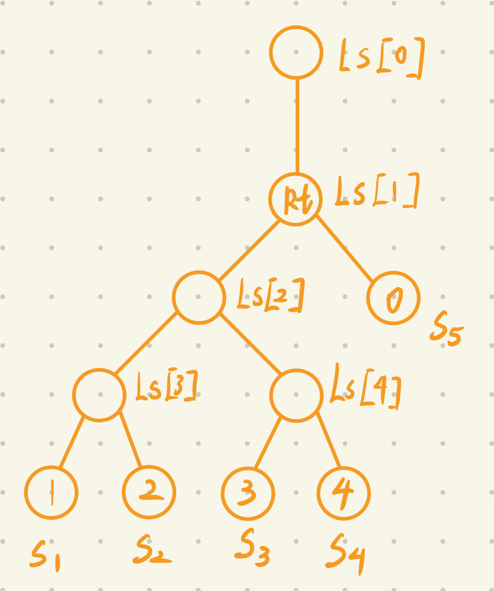

### 选择题
1. 在对N个元素进行排序时，基于比较的算法中，其“最坏时间复杂度”中最好的是：$C$
  A. O(logN)
  B. O(N)
  C. O(N*logN)
  D. O(N*N)
2. 下列排序算法中，哪种算法可能出现：在最后一趟开始之前，所有的元素都不在其最终的位置上？（设待排元素个数N2）$B$
  A. 冒泡排序
  B. 插入排序
  C. 堆排序
  D. 快速排序
3. 对一组数据{ 2，12，16，88，5，10 }进行排序，若前三趟排序结果如下：
  第一趟排序结果：2，12，16，5，10，88
  第二趟排序结果：2，12，5，10，16，88
  第三趟排序结果：2，5，10，12，16，88
  则采用的排序方法可能是：$A$
  A. 冒泡排序
  B. 希尔排序
  C. 归并排序
  D. 基数排序
4. 就排序算法所用的辅助空间而言，堆排序、快速排序、归并排序的关系是：$C$
  A. 堆排序 < 归并排序 < 快速排序
  B. 堆排序 > 归并排序 > 快速排序
  C. 堆排序 < 快速排序 < 归并排序
  D. 堆排序 > 快速排序 > 归并排序
5. 下面四种排序算法中，稳定的算法是：$C$
  A. 堆排序
  B. 希尔排序
  C. 归并排序
  D. 快速排序
6. 在待排序的元素序列基本有序的前提下，效率最高的排序方法是？$A$
  A. 插入排序 
  B.选择排序 
  C. 快速排序 
  D. 归并排序
7. 有组记录的排序码为{ 46，79，56，38，40，84 }，则利用堆排序的方法建立的初始堆为 $D$
  A. 79，46，56，38，40，80
  B. 84，79，56，46，40，38
  C. 84，56，79，40，46，38
  D. 84，79，56，38，40，46
8. 给出关键字序列{ 321，156，57，46，28，7，331，33，34，63 }，下面哪个选择是按次位优先（LSD）链式基数排序进行了一趟分配和收集的结果？$B$
  A. →331→321→33→63→34→156→46→57→7→28
  B. →321→331→33→63→34→156→46→57→7→28
  C. →156→28→321→331→33→34→46→57→63→7
  D. →57→46→28→7→33→34→63→156→321→331
9. 若数据元素序列{ 12, 13, 8, 11, 5, 16, 2, 9 }是采用下列排序方法之一得到的第一趟排序后的结果，则该排序算法只能是：$D$
  A. 快速排序
  B. 选择排序
  C. 堆排序
  D. 归并排序
10. 有组记录的排序码为{46，79，56，38，40，84 }，采用快速排序（以位于最左位置的对象为基准而）得到的第一次划分结果为：$D$
  A. {38,46,79,56,40,84}
  B. {38,79,56,46,40,84}
  C. {38,46,56,79,40,84}
  D. {40,38,46,56,79,84}
11. 假设某文件经内部排序后形成了50个初始归并段，采用4路归并需要几趟完成排序？$B$
  A. 2
  B. 3
  C. 4
  D. 5
12. 在外排序时，用替换选择法可以创建尽可能长的初始有序段。假设内存中用到的工作空间规模为5。给定输入序列{5, 19, 25, 45, 30, 24, 15, 60, 16, 27, 1}，下列哪组是生成的有序段？$D$
  A. run1: 5, 19, 25, 30, 45; run2: 15, 16, 24, 27, 60; run3: 1
  B. run1: 5, 19, 24, 25, 30, 45; run2: 1, 15, 16, 27, 60
  C. run1: 5, 19, 25, 30, 45; run2: 1, 15, 16, 24, 27, 60
  D. run1: 5, 19, 24, 25, 30, 45, 60; run2: 1, 15, 16, 27
13. 在外排序中，设我们有5个长度分别为2、8、9、5、3的有序段。则下列哪种归并顺序可以得到最短归并时间？$B$
  A. 归并长度为2和3的有序段，得到段Run#1；将Run#1与长度为5的有序段归并，得到段Run#2；将Run#2与长度为8的有序段归并，得到段Run#3；将Run#3与长度为9的有序段归并
  B. 归并长度为2和3的有序段，得到段Run#1；将Run#1与长度为5的有序段归并，得到段Run#2；归并长度为8和9的有序段，得到段Run#3；归并Run#2和Run#3
  C. 归并长度为2和3的有序段，得到段Run#1；归并长度为5和8的有序段，得到段Run#2；归并Run#1和Run#2，得到段Run#3；将Run#3与长度为9的有序段归并
  D. 归并长度为2和3的有序段，得到段Run#1；归并长度为5和8的有序段，得到段Run#2；将Run#2与长度为9的有序段归并，得到段Run#3；归并Run#1和Run#3

### 简答题
1. 以关键码序列(503, 087, 512, 061, 908, 170, 897, 275, 653, 426)为例，手工执行以下排序算法，写出每一趟排序结束时的关键码状态：           
  (1) 直接插入排序          
     087, 503, 512, 061, 908, 170, 897, 275, 653, 426
     087, 503, 512, 061, 908, 170, 897, 275, 653, 426
     061, 087, 503, 512, 908, 170, 897, 275, 653, 426
     061, 087, 503, 512, 908, 170, 897, 275, 653, 426
     061, 087, 170, 503, 512, 908, 897, 275, 653, 426
     061, 087, 170, 275, 503, 512, 897, 908, 653, 426
     061, 087, 170, 275, 503, 512, 653, 897, 908, 426
     061, 087, 170, 275, 426, 503, 512, 653, 897, 908
  (2) 希尔排序(d[1]=5, d[2]=3, d[3]=1)        
    170, 087, 275, 061, 426, 503, 897, 512, 653, 908
    061, 087, 275, 170, 426, 503, 897, 512, 653, 908
    061, 087, 275, 170, 426, 503, 897, 512, 653, 908
    061, 087, 275, 170, 426, 503, 897, 512, 653, 908
    061, 087, 170, 275, 426, 503, 897, 512, 653, 908
    061, 087, 170, 275, 426, 503, 897, 512, 653, 908
    061, 087, 170, 275, 426, 503, 897, 512, 653, 908
    061, 087, 170, 275, 426, 503, 897, 512, 653, 908
    061, 087, 170, 275, 426, 503, 512, 897, 653, 908
    061, 087, 170, 275, 426, 503, 512, 653, 897, 908
    061, 087, 170, 275, 426, 503, 512, 653, 897, 908
  (3) 快速排序
    426, 087, 275, 061, 170, 503, 897, 908, 653, 512
    170, 087, 275, 061, 426, 503, 512, 653, 897, 908
    061, 087, 170, 275, 426, 503, 512, 653, 897, 908
    061, 087, 170, 275, 426, 503, 512, 653, 897, 908
  (4) 堆排序（用小根堆）    
    建堆：061, 087, 170, 275, 426, 512, 897, 503, 653, 908
    087, 275, 170, 503, 426, 512, 897, 908, 653, 061
    170, 275, 512, 503, 426, 653, 897, 908, 087, 061
    275, 426, 512, 503, 908, 653, 897, 170, 087, 061
    426, 503, 512, 897, 908, 653, 275, 170, 087, 061
    503, 897, 512, 653, 908, 426, 275, 170, 087, 061
    512, 897, 908, 653, 503, 426, 275, 170, 087, 061
    653, 897, 908, 512, 503, 426, 275, 170, 087, 061
    897, 908, 653, 512, 503, 426, 275, 170, 087, 061
    908, 897, 653, 512, 503, 426, 275, 170, 087, 061
    反转： 061, 087, 170, 275, 426, 503, 512, 653, 897, 908
  (5) 归并排序   
    087, 503, 061, 512, 170, 908, 275, 897, 426, 653
    061, 087, 503, 512, 170, 275, 897, 908, 426, 653
    061, 087, 170, 275, 503, 512, 897, 908, 426, 653
    061, 087, 170, 275, 426, 503, 512, 653, 897, 908  
  (6) 基数排序
    170, 061, 512, 503, 653, 275, 426, 087, 897, 908
    061, 087, 170, 275, 426, 503, 512, 653, 897, 908  
2. 败者树中的“败者”是指什么？若利用败者树求k个数中的最大值，在某次比较中a>b，那么谁是败者？败者树调整时的比较和堆调整时的比较有何区别？画出用于5路归并的败者树。
    1. 败者指在比较时输掉的那一个元素，比如，如果是求最大值，就是较小的元素
    2. b 是败者
    3. 败者树的调整是从叶子结点到根结点，每次和父结点比较；堆的调整是从根结点开始的，每个和两个子结点比较。




### 算法题

1. 试以单链表为存储结构实现简单选择排序算法。
```
void selectSort(LinkList l)
{
    LNode* head = l;
    
    while (head->next->next)
    {
        LNodee* prior = prev = head, curr = minv = head->next;

        while (curr)
        {
            if (curr->data < minv->data)
                minv = curr, prev = prior;
            prior = curr;
            curr = curr->next;
        }

        prev->next = minv->next;
        minv->next = head->next;
        head->next = minv;
        head = minv;
    }
}
```
2. 冒泡排序算法优化，将基本冒泡算法中起控制作用的布尔变量change改成一个整型变量，至少每一趟排序中进行交换的最后一个记录的位置，并以它作为下一趟冒泡排序循环终止的控制值。
```
void bubbleSort(int a[], int n)
{
    int flag = n - 1;
    for (int i = 0; i < flag ; i ++ )
    {
        int idx = 0;
        for (int j = 0; j < flag; j ++ )
            if (a[j] > a[j + 1]) 
            {
                int temp = a[j];
                a[j] = a[j + 1];
                a[j + 1] = temp;
                idx = j;
            }
        flag = idx;
    }
}
```
   