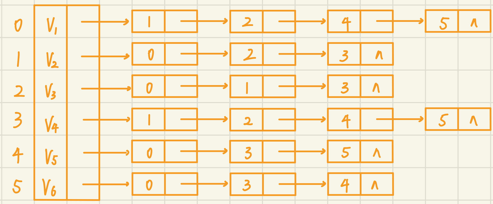

#### 选择题
1. 在n条边的无向图的邻接表存储中，边结点的个数有（    $B$     ）个 ？
  A、  n 
  B、 2n 
  C、 n/2 
  D、 n*n
2. 已知无向图G含有16条边，其中度为4的顶点个数为3，度为3的顶点个数为4，其它顶点的度均小于3。则图G中所含的顶点数至少是（     $B$     ）
  A、10 
  B、11
  C、13
  D、15
3. n个顶点的有向连通图，至少需要（    $A$    ）条弧
  A、n-1
  B、n
  C、n+1
  D、2n
4. 下列哪一种图的邻接矩阵是对称矩阵？(     $B$     )
  A、有向图 
  B、无向图 
  C、有向无环图 
  D、有向带权图
5. 下面给出的有向图中，各个顶点的入度和出度分别是：($A$)

  A、入度: 0, 2, 3, 1, 2; 出度: 3, 2, 1, 1, 1
  B、入度: 3, 2, 1, 1, 1; 出度: 0, 2, 3, 1, 2
  C、入度: 3, 4, 4, 2, 3; 出度: 3, 4, 4, 2, 3
  D、入度: 0, 1, 2, 1, 1; 出度: 3, 2, 1, 1, 1
6. 如果无向图G必须进行两次广度优先搜索才能访问其所有顶点，则下列说法中不正确的是：($B$)
  A、G肯定不是完全图
  B、G中一定有回路
  C、G一定不是连通图
  D、G有2个连通分量
7. 在有向图G的拓扑序列中，若顶点$V_i$在顶点$V_j$之前，则下列情形不可能出现的是（$D$）。
  A、G中有弧$<V_i,V_j>$
  B、G中有一条从$V_i$到$V_j$的路径
  C、G中没有弧$<V_i,V_j>$
  D、G中有一条从$V_j$到$V_i$的路径

#### 判断题
1. 求最小生成树的Prim算法在边较少、结点较多时效率较高 （    $F$   ） 
2. 图的最小生成树的形状可能不唯一（    $T$   ） 
3. 用邻接矩阵存储一个图时，在不考虑压缩存储的情况下，所占用的存储空间大小只与图中结点个数有关，而与图的边数无关（   $T$  ） 
4. 邻接表法只用于有向图的存储，邻接矩阵对于有向图和无向图的存储都适用（   $F$  ） 
5. 任何无向图都存在生成树（   $F$  ） 
6. 连通分量是无向图中的极小连通子图（   $F$  ） 
7. 关键路径是AOE网中从源点到汇点的最短路径 ($F$)

#### 简答题
1、请给出下图所示有向图的

a. 每个顶点的入/出度
> $V_1$: 入度: 3 出度: 0
> $V_2$: 入度: 2 出度: 2
> $V_3$: 入度: 1 出度: 2
> $V_4$: 入度: 1 出度: 3
> $V_5$: 入度: 2 出度: 1
> $V_6$: 入度: 2 出度: 3

b. 邻接矩阵
> $\begin{bmatrix}
  0 & 0 & 0 & 0 & 0 & 0 \\
  1 & 0 & 0 & 1 & 0 & 0 \\
  0 & 1 & 0 & 0 & 0 & 1 \\
  0 & 0 & 1 & 0 & 1 & 1 \\
  1 & 0 & 0 & 0 & 0 & 0 \\
  1 & 1 & 0 & 0 & 1 & 0 \\
\end{bmatrix}$

c. 逆邻接表


2、针对下图所示的无向图

a. 画出邻接表，它所邻接到的顶点序号由小到大排列


b. 基于上述邻接表结构，列出从顶点1出发深度优先搜索遍历该图所得顶点序列和边的序列。 
$V_1, \ V_2, \ V_3, \ V_4, \ V_5, \ V_6$
$<V_1, \ V_2>, \ <V_2, \ V_3>, \ <V_3, \ V_4>, \ <V_4, \ V_5>, \ <V_5, \ V_6>$

c. 基于上述邻接表结构，列出从顶点1出发广度优先搜索遍历该图所得顶点序列和边的序列。 
$V_1, \ V_2, \ V_3, \ V_5, \ V_6, \ V_4$
$<V_1, \ V_2>, \ <V_1, \ V_3>, \ <V_1, \ V_5>, \ <V_1, \ V_6>, \ <V_2, \ V_4>$

3、分别画出按以下两种算法求所示无向带权图的最小生成树的过程

a. Prim 算法


b. Kruskal 算法


4、试列出下图中全部可能的拓扑有序序列，并指出应用教材中算法7.12 TopologicalSort求得的是哪一个。
1, 5, 2, 3, 6, 4
1, 5, 2, 6, 3, 4
1, 5, 6, 2, 3, 4
第三个

5、对于如下AOE网络求关键路径

ve[1] = 0, ve[2] = 6, ve[3] = 4, ve[4] = 5, ve[5] = 7, ve[6] = 7, ve[7] = 16, ve[8] = 15, ve[9] = 19
vl[9] = 19, vl[8] = 15, vl[7] = 17, vl[6] = 11, vl[5] = 7, vl[4] = 9, vl[3] = 6, vl[2] = 6, vl[1] = 0
e[1] = 0, e[2] = 0, e[3] = 0, e[4] = 6, e[5] = 4, e[6] = 5, e[7] = 7, e[8] = 7, e[9] = 7, e[10] = 16, e[11] = 15
l[1] = 0, l[2] = 2, l[3] = 4, l[4] = 6, l[5] = 6, l[6] = 11, l[7] = 8, l[8] = 7, l[9] = 11, l[10] = 17, l[11] = 15
关键路径为 $a_1, \ a_4, \ a_8, \ a_11$

6、对于下图

a. 使用Dijkstra算法求从a出发到其它顶点的最短路径，画出依次产生各顶点的最短路径的过程


b. 使用Floyd算法求各顶点之间的最短路径，画出求解过程。
$$\begin{aligned}
  &\begin{vmatrix}
    0 & 3 & \infty & 4 & \infty & 5 \\
    \infty & 0 & 1 & \infty & \infty & 5 \\
    \infty & \infty & 0 & 5 & \infty & \infty \\
    \infty & 3 & \infty & 0 & \infty & \infty \\
    \infty & \infty & \infty & 3 & 0 & 2 \\
    \infty & \infty & \infty & 2 & \infty & 0 
  \end{vmatrix}
  \begin{vmatrix}
    0 & 3 & 4 & 4 & \infty & 5 \\
    \infty & 0 & 1 & \infty & \infty & 5 \\
    \infty & \infty & 0 & 5 & \infty & \infty \\
    \infty & 3 & 4 & 0 & \infty & 8 \\
    \infty & \infty & \infty & 3 & 0 & 2 \\
    \infty & \infty & \infty & 2 & \infty & 0 
  \end{vmatrix} \\
  &\begin{vmatrix}
    0 & 3 & 4 & 4 & \infty & 5 \\
    \infty & 0 & 1 & 6 & \infty & 5 \\
    \infty & \infty & 0 & 5 & \infty & \infty \\
    \infty & 3 & 4 & 0 & \infty & 8 \\
    \infty & \infty & \infty & 3 & 0 & 2 \\
    \infty & \infty & \infty & 2 & \infty & 0 
  \end{vmatrix}
  \begin{vmatrix}
    0 & 3 & 4 & 4 & \infty & 5 \\
    \infty & 0 & 1 & 6 & \infty & 5 \\
    \infty & 8 & 0 & 5 & \infty & 13 \\
    \infty & 3 & 4 & 0 & \infty & 8 \\
    \infty & 6 & 7 & 3 & 0 & 2 \\
    \infty & 5 & 6 & 2 & \infty & 0 
  \end{vmatrix} \\
  &\begin{vmatrix}
    0 & 3 & 4 & 4 & \infty & 5 \\
    \infty & 0 & 1 & 6 & \infty & 5 \\
    \infty & 8 & 0 & 5 & \infty & 13 \\
    \infty & 3 & 4 & 0 & \infty & 8 \\
    \infty & 6 & 7 & 3 & 0 & 2 \\
    \infty & 5 & 6 & 2 & \infty & 0 
  \end{vmatrix}
  \begin{vmatrix}
    0 & 3 & 4 & 4 & \infty & 5 \\
    \infty & 0 & 1 & 6 & \infty & 5 \\
    \infty & 8 & 0 & 5 & \infty & 13 \\
    \infty & 3 & 4 & 0 & \infty & 8 \\
    \infty & 6 & 7 & 3 & 0 & 2 \\
    \infty & 5 & 6 & 2 & \infty & 0 
  \end{vmatrix}
\end{aligned}$$

#### 算法题
1、有向图中顶点的入度统计
```cpp
void CountInDegree(VNode a[], int n, int in[])
{
    for (int i = 0; i < n; i ++ )
    {
      ArcNode* u = a[i].first;
      while (u)
      {
          in[u->adjvex] ++ ;
          u = u->next;
      }
    }
}
```

2、无向图连通分量个数
```cpp
int CountConnectedComponent(MGraph G)
{
    int vis[MaxVexNum] = {0}, q[MaxVexNum];
    int n = G.vexnum, cnt = 0;

    for (int i = 0; i < n; i ++ )
        if (!vis[i])
        {
            cnt ++ ;
            int hh = 0, tt = 0;
            q[0] = i, vis[i] = 1;
            while (hh <= tt)
            {
                int u = q[hh ++ ];
                for (int j = 0; j < n; j ++ )
                    if (G.arcs[u][j])
                    {
                        q[ ++ tt] = j;
                        vis[j] = 1;
                    }
            }
        }
    
    return cnt;
}
```
