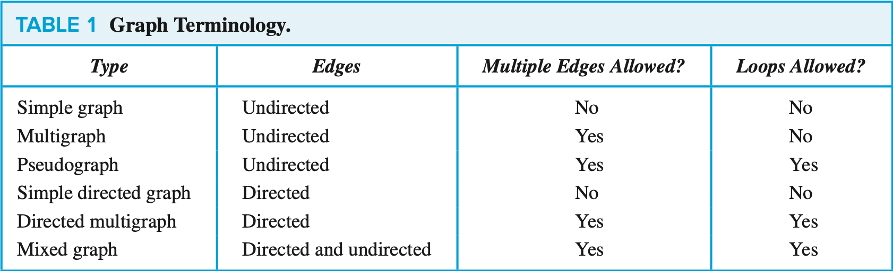

## Advanced counting 

### Applications of Recurrence Relations

It depends.

### Solving Linear Recurrence Relations

#### Theorem 1
> Let $c_1$ and $c_2$ be real numbers. Suppose that $r_2 − c_1r − c_2 = 0$ has two distinct roots $r_1$ and $r_2$. Then the sequence {$a_n$} is a solution of the recurrence relation $a_n = c_1a_{n−1} + c_2a_{n−2}$ if and only if $an = \alpha_1r_1^n + \alpha_2r_2^n (\forall n=0,1,2, \dots)$, where 𝛼1 and 𝛼2 are constants.
> $$a_0 = C_0 = \alpha_1 + \alpha_2 \\ a_1 = C_1 = \alpha_1r_1 + \alpha_2r_2$$ $$C_1 = \alpha_1r_1 + (C_0 - \alpha_1)r_2 = \alpha_1(r_1 - r_2) + C_0r_2$$ $$\begin{cases}
    \alpha_1 = \frac{C_1 - C_0r_2}{r_1 - r_2} \\
    \alpha_2 = C_0 - \alpha_1 = C_0 - \frac{C_1 - C_0r_2}{r_1 - r_2} = \frac{C_0r_1 - C_1}{r_1 - r_2}
\end{cases}$$

Problem. What is the solution of the recurrence relation $$a_n = a_{n-1} + 2a_{n-2}$$ with $a_0 = 2$ and $a_1 = 7$

Solution.
> The characteristic equation of the recurrence relation is $r^2 - r - 2$. Its roots are $r = 2$ and $r = -1$. Hence, the solution to this recurrence relation is $$a_n = \alpha_12^n + \alpha_2(-1)^n$$ for some constants $\alpha_1$ and $alpha_2$. Using the initial conditions, it follows that $$\begin{aligned}
    a_0 = 2 = \alpha_1 + \alpha_2 \\ a_1 = 7 = \alpha_1 \cdot 2 + \alpha_2 \cdot (-1)
\end{aligned}$$ Solving these two equations shows that $\alpha_1 = 3$ and $\alpha_2 = -1$. Hence, the solution to the recurrence relation and initial conditions is the sequence {$a_n$} with $$a_n = 3 \cdots 2^n - (-1)^n$$

#### Theorem 2
> Let $c_1$ and $c_2$ be real numbers with $\underline{c_2 \ne 0}$.Suppose that $r_2 − c_1r − c_2 = 0$ has only one root $r_0$. A sequence {$a_n$} is a solution of the recurrence relation $a_n = c_1a_{n−1} + c_2a_{n−2}$ if and only if $an =\alpha_1r_0^n +\alpha_2nr_0^n, \forall n=0,1,2,\dots$, where 𝛼1 and 𝛼2 are constants.

Problem. What is the solution of the recurrence relation $$a_n = 6a_{n-1} - 9a_{n-2}$$ with initial conditions $a_0 = 1$ and $a_1 = 6$.

Solution.
> The only root of $r^2 - 6r + 9 = 0$ is $r = 3$. Hence the solution (to this recurrence relation) is $$a_n = \alpha_13^n + \alpha_2n3^n$$ for some constant $\alpha_1$ and $\alpha_2$. Using the initial conditions, it follows that $$\begin{aligned}
    1 = a_0 = \alpha_1 \\ 6 = a_1 = \alpha_1 \cdot 3 + \alpha_2 \cdot 3
\end{aligned}$$ Solving these two equations shows that $\alpha_1 = \alpha_2 = 1$. Hence, the solution to the recurrence relation and initial conditions is $$a_n = 3^n + n3^n$$

### Linear Nonhomogeneous Recurrence Relations with Constant Coefficients

#### Theorem 5
> If {$a_n^{(p)}$} is a particular solution of the nonhomogeneous linear recurrence relation with constant coefficients $$a_n = c_1a_{n-1} + c_2a_{n-2} + \dots + c_ka_{n-k} + F(n)$$ then every solution is of the form {$a_n^{(p)} + a_n^{(h)}$}, where {$a_n{(h)}$} is a solution of the associated homogeneous recurrence relation $$a_n = c_1a_{n-1} + c_2a_{n-2} + \dots + c_ka_{n-k}$$

#### Theorem 6
> Suppose that {$a_n$} satisfies the linear nonhomogeneous recurrence relation $$a_n = c_1a_{n-1} + c_2a_{n-2} + \dots + c_ka_{n-k} + F(n)$$, where $c_1,c_2,\dots,c_k$ are real numbers, and $$F(n) = (b_tn^t + b_{t-1}n^{t-1} + \dots + b_1n + b_0)s^n$$, where $b_0, b_1, \dots , b_t$ and $s$ are real numbers. When $s$ $\underline{is not a root of the characteristic equation of the associated linear homogeneous recurrence relation}$, there is a particular solution of the form $$(p_tn^t + p_{t-1}n^{t-1} + \dots + p_1n + p_0)s^n$$. When $s$ is a root of this characteristic equation and its multiplicity is $m$, there is a particular solution of the form $$n^m(p_tn^t + p_{t-1}n^{t-1} + \dots + p_1n + p_0)s^n$$

### Divide-and-Conquer Algorithms and Recurrence Relations

#### Theorem 1
> $f(n) = af(n/b) + c$ whenever $n$ is divisible by $b$, b is an interger greater than $1$, and $c$ is a positive real number. Then $$f(n) is \begin{cases}
    O(n^{\log_ba}) \quad \text{if} \ a > 1 \\
    O(\log n) \quad \ \text{if} \ a = 1
\end{cases}$$ $$f(n) = C_1n^{\log_ba} + C_2 \quad \text{if} \ n = b^k \ \text{and}  \ a \ne 1$$

### Generating Functions

#### Theorem 1
> Let $f(x) = \sum_{k=0}^{\infty}a_kx^k$ and $g(x) = \sum_{k=0}^{\infty}b_kx^k$. Then $$f(x) + g(x) = \sum_{k=0}^{\infty}(a_k + b_k)x^k \quad \text{and} \quad f(x) + g(x) = \sum_{k=0}^{\infty}(\sum_{j=0}^{k}a_jb_{k-j})x^k$$

#### Definition 2
>Let $u$ be a real number and $k$ a nonnegative integer. Then the extended binomial coefficient $\begin{pmatrix}
    u \\ k
\end{pmatrix}$ is defined by $$\begin{pmatrix}
    u \\ k
\end{pmatrix} = \begin{cases}
        u(u-1)\dots(u-k+1) / k! \quad \text{if} \ k > 0 \\ 1 \qquad \qquad \qquad \qquad \qquad \quad \ \ \  \text{if} \ k = 0
    \end{cases}$$

#### Theorem x
> $$\begin{pmatrix}
    -n \\ r
\end{pmatrix} = (-1)^r\begin{pmatrix}
    n + r - 1 \\ r
\end{pmatrix}$$

#### Theorem 2
> Let $x$ be a real number with $|x| < 1$ and let $u$ be a real number. Then $$(1+x)^u = \sum_{k=0}^{\infty}\begin{pmatrix}
    u \\ k
\end{pmatrix}x^k$$

### Using Generating Functions to Solve Recurrence Relations

Solve the recurrence relation $a_k = 3a_{k−1} \forall k = 1, 2, 3, \dots$ and initial condition $a_0 = 2$.

> Let $G(x)$ be the generating function for the sequence {$a_k$}, that is, $G(x) = \sum_{k=0}^{\infty}a_kx^k$. First note that $$xG(x) = \sum_{k=0}^{\infty}a_kx^{k+1} = \sum_{k=1}^{\infty}a_{k-1}x^k$$
> Using the recurrence relation, we see that $$\begin{aligned}
    G(x) - 3xG(x) &= \sum_{k=0}^{\infty}a_kx^k - 3\sum_{k=1}^{\infty}a_{k-1}x^k \\ &= a_0 + \sum_{k=1}^{\infty}(a_k - 3a_{k-1})x^k \\ &= 2
\end{aligned}$$
> Because $a_0 = 2$ and $a_k = 3a_{k-1}$. Thus, $$G(x) - 3xG(x) = (1-3x)G(x) = 2 \\ G(x) = \frac{2}{1-3x} = 2\sum_{k=0}^{\infty}3^kx^k = \sum_{k=0}^{\infty}2 \cdot 3^k$$ 
> Consequently, $a_k = 2 \cdot 3^k$

Solve the recurrence relation $a_n = 8a_{n−1} + 10^{n-1} \ \forall k = 1, 2, 3, \dots$ and initial condition $a_1 = 9$.
> Assume $a_0 = 1$, then $a_1 = 8a_0 + 10^0 = 9$, which is consistent with our original initial condition
> We multiply both sides of the recurrence relation by $x^n$ to obtain $$a_nx^n = 8a_{n-1}x^n + 10^{n-1}x^n$$
> Let $G(x) = \sum_{k=0}^{\infty}a_nx^n$ be the generating function of the sequence $a_0, a_1, a_2,\dots$. We sum both
sides of the last equation starting with $n = 1$, to find that $$\begin{aligned}
    G(x) - 1 &= \sum_{n=1}^{\infty}a_nx^n = \sum_{n=1}^{\infty}(8a_{n-1}x^n + 10^{n-1}x^n) \\ &= 8\sum_{n=1}^{\infty}a_{n-1}x^{n-1} + \sum_{n=1}^{\infty}10^{n-1}x^n \\ &= 8\sum_{n=0}^{\infty}a_nx^n + x\sum_{n=0}^{\infty}10^nx^n \\ &= 8G(x) + \frac{x}{1 - 10x}
\end{aligned}$$
> Solving for G(x) shows that $$\begin{aligned}
    G(x) &= \frac{1-9x}{(1-8x)(1-10x)} \\ &= \frac{1}{2}(\frac{1}{1-8x} + \frac{1}{1-10x}) \\ &= \frac{1}{2}(\sum_{n=0}^{\infty}8^nx^n + \sum_{n=0}^{\infty}10^nx^n) \\ &= \sum_{n=0}^{\infty}\frac{1}{2}(8^n + 10^n)x^n
\end{aligned}$$
> Consequently, we have shown that $$a_n = \frac{1}{2}(8^n + 10^n)$$

## Graphs and Graph Models

#### when the context is clear, we will use the term graph to refer only to undirected graphs.

Simple graph: A graph in which each edge connects two different vertices and where no two edges connect the same pair of vertices.

Multigraph: Graph that may have multiple edges connecting the same vertices.

Directed multigraphs: Directed graphs that may have multiple directed edges from a vertex to a second (possibly the same) vertex.

Multiplicity: When there are $m$ directed edges, each associated to an ordered pair of vertices $(u, v)$, we say that $(u, v)$ is an edge of multiplicity m.

$K_n$: Complete Graphs, a simple graph that contains exactly one edge between each pair of distinct vertices.

$C_n$: Cycle, as it says.

$W_n$: Wheel, add an additional vertex to a cycle $C_n$, for $n \geq 3$, and connect this new vertex to each of the $n$ vertices in $C$.

$Q_n$: n-Cube, a graph that has vertices representing the $2^n$ bit strings of length $n$. Two vertices are adjacent if and only if the bit strings that they represent differ in exactly one bit position. 

Bipartite Graph: A simple graph $G$ is called bipartite if its vertex set $V$ can be partitioned into two disjoint sets $V_1$ and $V_2$ such that every edge in the graph connects a vertex in $V_1$ and a vertex in $V_2$.

$K_{m,n}$: Complete Bipartite Graphs, a graph that has its vertex set partitioned into two subsets of m and n vertices, respectively with an edge between two vertices if and only if one vertex is in the first subset and the other vertex is in the second subset.

$M$: Matching, a subset of the set $E$ of edges of the graph such that no two edges are incident with the same vertex. 

Maximum Matching: a matching with the largest number of edges.

Complete matching from $V_1$ to $V_2$: a matching $M$ in a bipartite graph $G = (V, E)$ with bipartition $(V_1,V_2)$ with $|M| = |V_1|$

#### Definition 1
> A graph $G = (V, E) $ consists of $V$, a nonempty set of vertices (or nodes) and $E$, a set of edges. Each edge has either one or two vertices associated with it, called its endpoints. An edge is said to connect its endpoints.

#### Definition 2
A directed graph (or digraph) $(V, E)$ consists of a nonempty set of vertices $V$ and a set of directed edges (or arcs) $E$. Each directed edge is associated with an ordered pair of vertices. The directed edge associated with the ordered pair $(u, v)$ is said to start at $u$ and end at $v$.

### Graph Terminology and Special Types of Graphs

#### Definition 1 Adjacent
>Two vertices $u$ and $v$ in an undirected graph $G$ are called adjacent (or neighbors) in $G$ if $u$ and $v$ are endpoints of an edge $e$ of $G$. Such an edge $e$ is called incident with the vertices $u$ and $v$ and $e$ is said to connect $u$ and $v$.

#### Definition 2 N(v)
>The set of all neighbors of a vertex $v$ of $G = (V, E)$, denoted by $N(v)$, is called the neighborhood of $v$. If $A$ is a subset of $V$, we denote by $N(A)$ the set of all vertices in G that are adjacent to at least one vertex in A. So, $N(A) = U_{v\in A}N(v)$.

#### Theorem 1 
> Let G = (V, E) be an undirected graph with m edges. Then $2m = \sum_{v\in V}deg(v)$

#### Theorem 2 
> An undirected graph has an even number of vertices of odd degree.

#### Definition 3 Adjacent in UG
> When $(u, v)$ is an edge of the graph $G$ with directed edges, $u$ is said to be adjacent to $v$ and $v$ is said to be adjacent from $u$.

#### Theorem 3 
> Let G = (V, E) be a graph with directed edges. Then $$\sum_{v \in V}deg^-(v) = \sum_{v \in V}deg^+(v) = |E|$$

#### Theorem 4
A simple graph is bipartite if and only if it is possible to assign one of two different colors to each vertex of the graph so that no two adjacent vertices are assigned the same color.

#### Theorem 5 
The bipartite graph $G = (V, E)$ with bipartition $(V1, V2)$ has a complete matching from $V_1$ to $V_2$ if and only if $|N(A)| \geq |A| $ for all subsets $A$ of $V_1$.

### Representing Graphs and Graph Isomorphism

### Connectivity

#### Definition 1
> An undirected graph is called connected if there is a path between every pair of distinct vertices of the graph. 

#### Theorem 1
> There is a simple path between every pair of distinct vertices of a connected undirected graph.

#### Definition 2
A connected component of a graph $G$ is a connected subgraph of $G$ that is not a proper subgraph of another connected subgraph of $G$.

#### Definition 3
> cut vertices (or articulation points),  the removal from a graph of a vertex and all incident edges produces a subgraph with more connected components.

> cut edge or bridge, an edge whose removal produces a graph with more connected components than in the original graph

#### Definition 4
> A directed graph is strongly connected if there is a path from a to b and from b to a whenever a and b are vertices in the graph.

> A directed graph is weakly connected if there is a path between every two vertices in the underlying undirected graph.

### Euler and Hamilton Paths

#### Theorem 1
> A connected multigraph with at least two vertices has an Euler circuit if and only if each of its vertices has even degree.

#### Theorem 2
> A connected multigraph has an Euler path but not an Euler circuit if and only if it has exactly two vertices of odd degree.

#### Theorem 3
> If G is a simple graph with n vertices with n ≥ 3 such that the degree of every vertex in G is at least n∕2, then G has a Hamilton circuit.

#### Theorem 4
> If G is a simple graph with n vertices with n ≥ 3 such that deg(u) + deg(v) ≥ n for every pair of nonadjacent vertices u and v in G, then G has a Hamilton circuit.

A tree with n vertices has n − 1 edges.

A full m-ary tree with i internal vertices contains n = mi + 1 vertices.

A full m-ary tree with
(i ) n vertices has i = (n − 1)∕m internal vertices and l = [(m − 1)n + 1]∕m leaves, (ii) iinternalverticeshasn=mi+1verticesandl=(m−1)i+1leaves,
(iii ) l leaves has n = (ml − 1)∕(m − 1) vertices and i = (l − 1)∕(m − 1) internal vertices.

There are at most mh leaves in an m-ary tree of height h.

If an m-ary tree of height h has l leaves, then h ≥ ⌈logm l⌉. If the m-ary tree is full and bal- anced, then h = ⌈logm l⌉. (We are using the ceiling function here. Recall that ⌈x⌉ is the small- est integer greater than or equal to x.)

#### 一、$\frac{dy}{dx} = \varphi(\frac{y}{x})$
> 令 $u = \frac{y}{x}$，有 $$y = ux, \quad \frac{dy}{dx} = \frac{d(ux)}{dx} = u + x\frac{du}{dx}$$ 原式化为 $$\frac{du}{u + \varphi(u)} = \frac{dx}{x}$$

#### 二、$\frac{dy}{dx} = \frac{ax + bx + C}{a_1x + b_1x + C_1}$
> 令 $x = X + h, \quad y = Y + k$，有 $$\frac{Y}{X} = \frac{aX + bY + ah + bk + C}{a_1X + b_1Y + a_1h + b_1l + C_1}$$ 令 $$\begin{cases}
    ah + bk + C = 0 \\ a_1h + b_1k + C_1 = 0
\end{cases}$$ 
> 1. $ab_1 \ne a_1b$ $$\frac{dY}{dX} = \frac{aX + bY}{a_1X + b_1Y} = \frac{a + b\frac{Y}{X}}{a_1 + b_1 \frac{Y}{X}} = \varphi(\frac{Y}{X})$$ 此时按照 $(一)$ 解.
> 2. $ab_1 = a_1b$ 
> 令 $\frac{a_1}{a} = \frac{b_1}{b} = \lambda$，有 $$\frac{dy}{dx} = \frac{ax + by + C}{\lambda(ax + by) + C_1}$$ 令 $v = ax + by$，有 $$\frac{dv}{dx} = a + b\frac{dy}{dx}$$ $$\frac{1}{b}(\frac{dv}{dx} - a) = \frac{v + C}{\lambda v + C_1}$$ 

#### 三、$\frac{dy}{dx} + P(x)y = Q(x)$
> 通解为 $$y = e^{-\int P(x)dx}(\int Q(x)e^{\int P(x)dx}dx + C)$$ 对 $\frac{dx}{dy}$ 依然成立

#### 四、$\frac{dy}{dx} + P(x)y = Q(x)y^n \quad (n \ne 0, 1)$
> 两边同除 $y^n$，得 $$y^{-n}\frac{dy}{dx} + P(x)y^{1-n} = Q(x)$$ $$\frac{1}{1-n}\frac{dy^{1-n}}{dx} + P(x)y^{1-n} = Q(x)$$ 令 $z = y^{1-n}$，有 $$\frac{dz}{dx} + (1-n)P(x)z = (1-n)Q(x)$$ 为 $(三)$

#### 五、$y^{(n)} = f(x)$
# 只因！

#### 六、$y'' = f(x, y')$
> 令 $y' = p(x)$，有 $$\frac{dy}{dx} = f(x, p)$$ 为 $(三)$，求完再只因一下

#### 七、$y'' = f(y, y')$
> 令 $y' = q(y)$，$y'' = \frac{dq}{dy}\frac{dy}{dx} = q\frac{dq}{dy}$，有 $$q\frac{dq}{dy} = f(y,q)$$ 为 $(三)$，求完再只因一下

#### 八、$y'' + p(x)y' + q(x)y = 0$
> 已知上述方程的一个特解 $y_1(x)$，有另一特解 $$y_2(x) = y_1(x)\int\frac{1}{y_1^2(x)}e^{-\int p(x)dx}dx$$

#### 九、$y'' + p(x)y' + q(x)y = f(x)$
> 已知对应的齐次方程的线性无关解 $y_1(x)$ 和 $y_2(x)$，有 $$Y(x) = C_1y_1(x) + C_2y_2(x)$$ 设非齐次方程的通解为 $y = y_1(x)C_1(x) + y_2(x)C_2(x)$，求导 $$y' = y_1'(x)C_1 + y_1(x)C_1' + y_2'(x)C_2 + y_2(x)C_2'$$ 可设 $y_1C_1' + y_2C_2' = 0$，有 $$y' = y_1'C_1 + y_2'C_2$$ 求导 $$y'' = y_1''C_1 + y_1'C_1' + y_2''C_2 + y_2'C_2'$$ 带入原方程解出 $C_1',C_2'$ 然后只因即可

#### 十、$y'' + py' + qy = 0$
> 特征方程 $r^2 + pr + q = 0$ 对应的特征根 $r_1, \ r_2$
> 1. $r_1 \ne r_2, r_1,r_2 \in R$ $$y = C_1e^{r_1x} + C_2e^{r_2x}$$
> 2. $r_1 = r_2, r_1,r_2 \in R$ $$y = C_1e^{r_1x} + C_2xe^{r_2x}$$
> 3. $r = \alpha \plusmn i\beta$ $$y = e^{\alpha x}(C_1cos\beta x + C_2sin\beta x)$$

#### 十一、$y^{(n)} + p_1y^{(n-1)} + \dots + p_{n-1}y' + p_ny = 0$
> |特征方程的根|微分方程的解|
> |---|---|
> |单实根 $r$|e^{rx}|
> |$k$ 重实根 $r$|$e^{rx}(C_1 + C_2x + \dots + C_{k}x^{k-1})$|
> |$r = \alpha \plusmn i\beta$|$e^{\alpha x}(C_1cos\beta x + C_2sin\beta x)$|
> |$k$ 重共轭 $r$|$e^{\alpha x}[(C_1 + C_2x + \dots + C_kx^{k-1})cos\beta x + (D_1 + D_2x + \dots + D_kx^{k-1})sin\beta x]$|

### 十二、$y'' + py' + qy = f(x)$
#### 1、$f(x) = e^{\lambda x}P_m(x)$
> $P_m(x)$，$Q_m(x)$ 是 $m$ 次多项式，$k$ 为特征根的重数
> 若 $\lambda$ 不是特征根，
> $$y* = e^{\lambda x}Q_m(x)$$
> 若 $\lambda$ 是单根，但 $2\lambda + p \ne 0$
> y* = e^{\lambda x}xQ_m(x)
> 若 $\lambda$ 是二重根且 $2\lambda + p = 0$
> y* = e^{\lambda x}x^kQ_m(x)

#### 2、$f(x) = P_x(x)e^{\alpha x}cos\beta x$
> $$y* = x^ke^{\alpha x}(Q_{m1}(x)cos\beta x - Q_{m2}(x)sin\beta x)$$

#### 3、$f(x) = P_m(x)e^{\alpha x}sin\beta x$
> $$y* = x^ke^{\alpha x}(Q_{m1}(x)sin\beta x + Q_{m2}cos\beta x)$$

#### 十三、$x^ny^{(n)} + p_1x^{n-1}y^{(n-1)} + P_2x^{n-2}y^{(n-2)} + \dots + p_{n-1}xy' + p_ny = f(x)$
> 令 $x = e^t$，只考虑 $(x > 0)$，$x < 0$ 可设 $x = -e^t$ $$\frac{dy}{dt} = \frac{dy}{dx}\frac{dx}{dt} = y'e^t = xy', \quad \frac{d^2y}{dt^2} = \frac{dx}{dt}y' + x\frac{dy'}{dx}\frac{dx}{dt} = xy' + x^2y'' \quad \text{此处 y 对 x 的导数}$$ 即 $$\frac{dy}{dt} = xy', \quad \frac{d^2y}{dt^2} = \frac{dy}{dt} + x^2y''$$ 代入，得 $$\frac{d^2y}{dt^2} - \frac{dy}{dt} + p\frac{dy}{dt} + qy = f(e^t)$$

### 