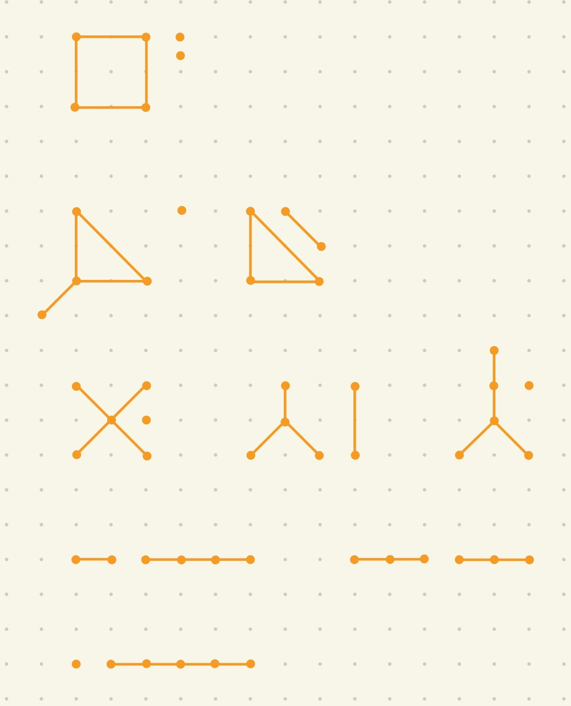

### 10.1

#### 22
> Team 4 beats Team 3
> Team 1, 2, 5, 6 beat Team 4

#### 34
> Statement $S_1, S_2, S_3, S_4$ must be excuted before $S_6$ is excuted

### 10.2

#### 12
> Assume the vertex below is $v$
> The degree of $v$ represents the number of people $v$ knows
> The neighborhood of $v$ is the people $v$ knows
> The isolated vertices represent they know nobody
> The pendant vertices represent they know exactly one people
> It means a person knows 1000 people on average

#### 42
> Since every edge contributes 2 degrees, the number of edges is $(4 + 3 + 3 + 2 + 2) / 2 = 7$

#### 64
> Since $G \cap \overline G$ is a complete graph, the new number of edges of each vertex should be 4 - the former one, that is, 0, 1, 1, 2, 2
> Hence the answer is 2, 2, 1, 1, 0

#### 72
> Since $G$ is n-regular and ($V_1$, $V_2$) is a bipartition of $V$, it is obvious that from the perspective of $V_1$, the degree of the graph is $n|V_1|$ since $\forall v \in V_1, \ \ deg(v) = n$, and wea can get the similar result from $V_2$, $n|V_2|$. Hence we have $n|V_1| = n|V_2|$, $|V_1| = |V_2|$
> Hence they contain the same number of vertices

### 10.3

#### 28
> 1. Sparse. Since a street intersection has less than 5 edges normally, which is much less than the number of vertices
> 2. Dense. Since nowadays buildings are usually close to each others
> 3. Sparse. Most people do not have brothers or sisters
> 4. Neither. It is hard to say because it depends on the actual situation、

#### 46 
> Not isomorphic. Since the two vertices with 4 degree in the left one are adjacent, but the right onr is not.

#### 52
> The row of a isolated vertex should only contain 0

#### 60
> 9

#### 68
> It is not isomorphic since there is no edge from out-degree = 2(only one vertex in the graph) to in-degree = 2(only one vertex in the graph) in the lest graph, but the right one does.