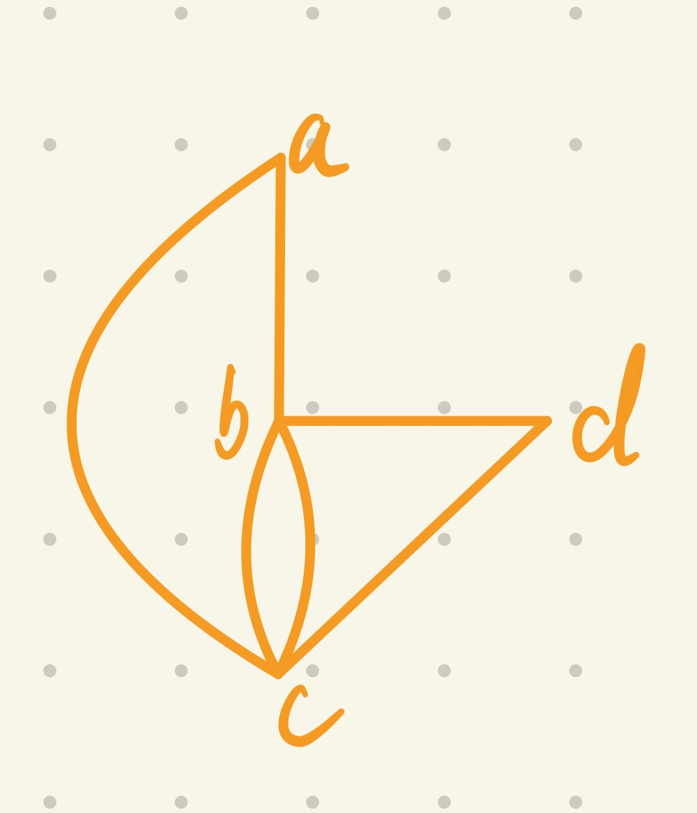
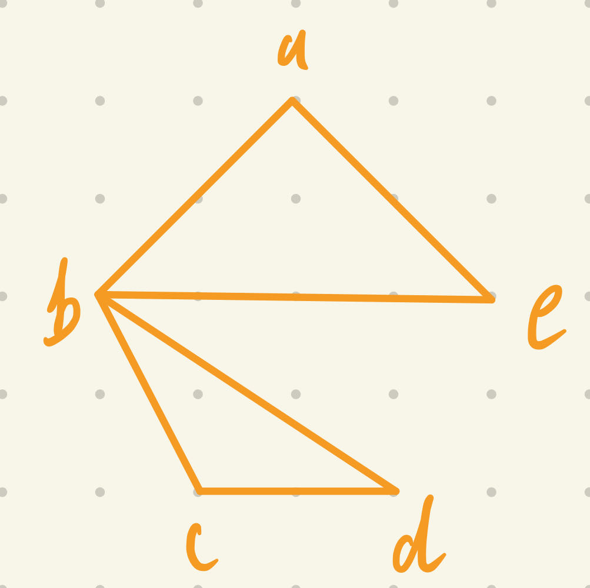

### 10.4

#### 14
> a) $\{a, \ e, \ b\}, \ \{d\}, \ \{c\}$
  b) $\{a\}, \ \{b\}, \ \{c, \ d, \ e\}, \ \{f\}$ 
  c) $\{a, \ b, \ c, \ d, \ f, \ g, \ h, \ i\}, \ \{e\}$

#### 28
> When $G$ has only one vertex, it is obviously connected with $0$ edges. Assume $G$ is connected with $k$ vertices $(k >= 1)$ and $k-1$ edges. When adding a new vertex $v$ to $G$, at least we need to add one edge between $u$ and $v$, where $u \in G$, to form a connected graph. Hence by mathematical induction, connected graph $G$ with $n$ vertices has at least $n-1$ edges.

#### 36
> If $c$ is a cut vertex, then the removal of it produces a subgraph $G'$ that is not connected. Assume after its removal there are $n$ connected components $G_1,\ G_2,\ \dots,\ G_n(n > 1)$. Taking two vertices $u, \ v$ ($u, v \ne c$) from $G_i$ and $G_j$($1 \leq i, \ j \leq n$). If there is a path between them withput passing through $c$, then they are connected, which contradicts they are not connected. Hence every path between $u$ and $v$ passes through $c$.
> If every path between $u$ and $v$ ($u, v \ne c$) passes through $c$, the the removal of $c$ results in that $u, \ v$ are no longer connected, in other words, they are in the different components. Hence the removal of $c$ produces at least two components, it is a cut vertex.

#### 60
> Assume $f$ is an isomorphism form graph $G$ to $H$. If $G$ has a simple circuit of length $k$ $u_1, u_2, \dots, u_k$, then $f(u_1), f(u_2), \dots, f(u_k)$ is a simple circuit in $H$. Obviously it is a circuit since edges $u_1u_2, u_2u_3, \dots, u_{k}u_{1}$ in $G$ corresponding to edges $f(u_1)f(u_2), f(u_2)(u_3), \dots, f(u_{k})(u_{1})$. And there is no edge repeated in this circuit in $G$, hence there is no edge repeated in the corresponding circuit in $H$

### 10.5

#### 8
> Since every vertex degree is even, there is an Euler circuit. $a, b, c, d, e ,j, c, h, i, d, b, g, h, m, n, o, j, i, n, l, m, f, g, l, k, f, a$

#### 10
> From the figure we can construct the graph below.
> 
> Obviously every vertex degree is even, so it has an Euler circuit, $b, c, d, b, c, a, b$

#### 16
> If the directed multigraph has an Euler circuit, then it is strongly connected (weakly connected as well) since the circuit allows us to travel from every vertex to any other vertices. By following the circuit, we can iterate through all the edges without repeating, and each time we pass a vertex $u$, both the in-degree and out-degree of $u$ plus $1$, hence the in-degree and out-degree of each vertex are equal.
> If the directed multigraph is weakly connected and etc, by following the proval of theorem 1, we can construct an Euler circuit.

#### 26
> a) In $K_n$, each vertex is connected with any other vertices, so the degree of each vertex is $n-1$. By Theorem $1$, only when $n$ is odd, each vertex has an even degree, therefore has an Euler circuit.
> b) Clearly for $n = 1, \ 2$, $G_n$ has no Euler circuit. For $n \geq 3$, Since each vertex is connected with two other vertices, each vertex in $G_n$ has an even degree, and has an Euler circuit.
> c) From b), we know that the vertices connected with vim have an odd degree, so for all $W_n$, there are no Euler circuit.
> d) Each vertex has the degree of $n$, hence when $n$ is even and $n \ne 0$, there is an Euler circuit.

#### 34
> Since the degrees of $a, c, e , g, i, k, n, l$ are all two, every edge incident with these vertices must be part of any Hamilton circuit. Assume we start from $a$ and get inside by passing edge $bj$ (which is same for other situation), in this case, for any Hamilton circuit would contain 3 edges incident with $j$, which is impossible.

#### 48
> Considering the graph below.
> 
> Obviously the degree of every vertex is greater than or equal to $(5-1)/2 = 2$. Now since the degrees of $a, e, c, d$ are all two, every edge incident with these vertices must be part of any Hamilton circuit, any Hamilton circuit would have to contain 4 edges incident with $b$, which is impossible

#### 58
> a) A knight (since no horse in chess) needs to visit each square once, which is same as the definition of Hamilton path.
> b) From a), we can see that a reentrant tour must contain a legal move from the last square to the initial square, which is same as that a Hamilton circuit must returns to its start vertex.

### 10.6

#### 8
> a) 2451
> b) 2715
> c) 2109
> d) 2943

#### 16
> We can add an array $pre$ to the algorithm. Each time $L$ is updated ($L(v) := L(u) + w(u, v)$), we recode $pre[v] := u$, standing for in the shortest path $u$ is the former vertex of $v$. And when the algorithm ends. We can use recursive algorithm to get the path.
```
void printRoute(int start, int end)
{
  if (end == start)
  {
      print(end);
      return;
  }
  printRoute(start, pre[end])
  print(end);
}
```

#### 18
> Not unique. Since though each edge has different weight, but some path (sum weight of some edges) may have the same weight.

#### 26
>| circuit | weight |
>| --- | --- |
>| a-b-c-d-e-a | 27 |
>| a-b-c-e-d-a | 23 |
>| a-b-d-c-e-a | 30 |
>| a-b-d-e-c-a | 26 |
>| a-b-e-c-d-a | 20 |
>| a-b-e-d-c-a | 20 |
>| a-c-b-d-e-a | 35 |
>| a-c-b-e-d-a | 25 | 
>| a-c-d-b-e-a | 32 |
>| a-c-e-b-d-a | 28 |
>| a-d-b-c-e-a | 35 |
>| a-d-c-b-e-a | 29 |
>
> Hence the minimum circuits are a-b-e-d-c-a and a-b-e-d-c-a