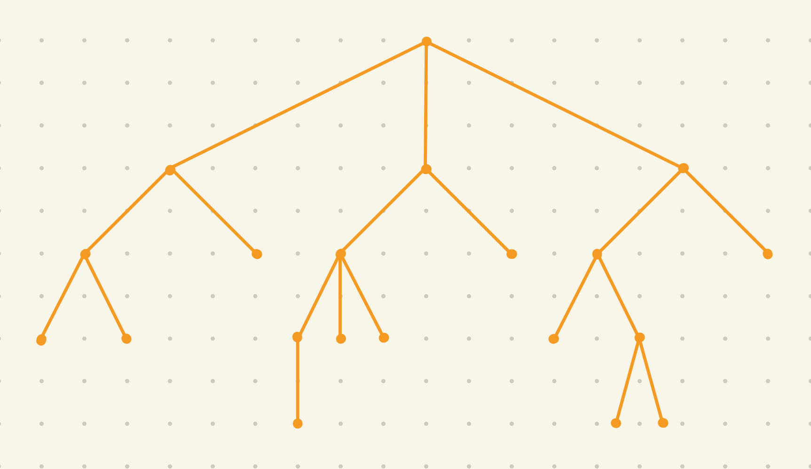
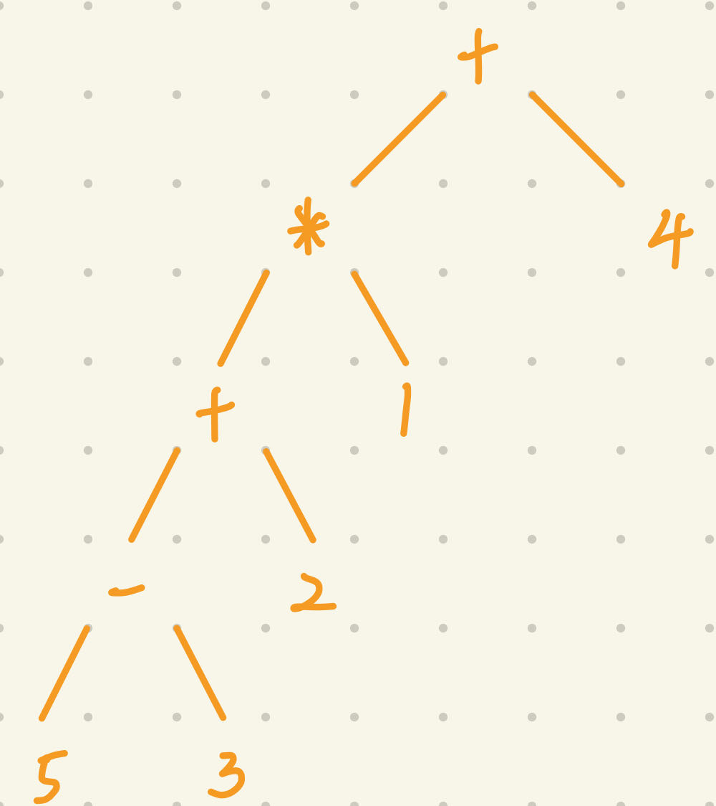
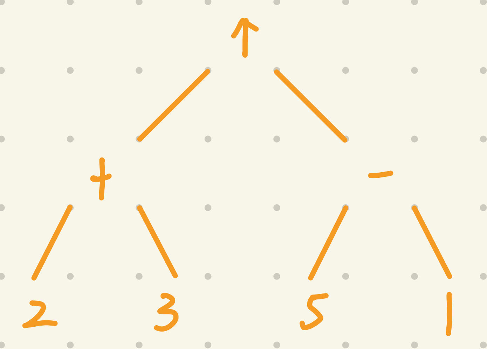
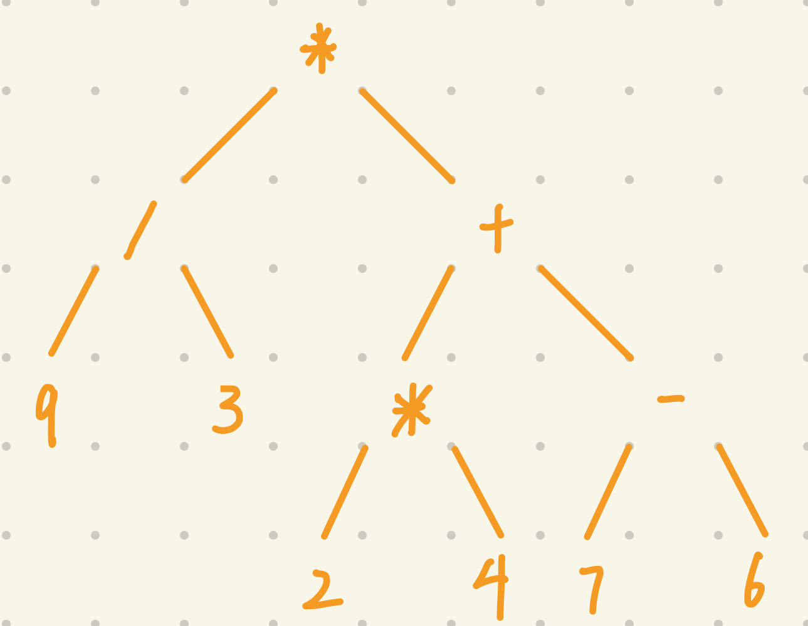
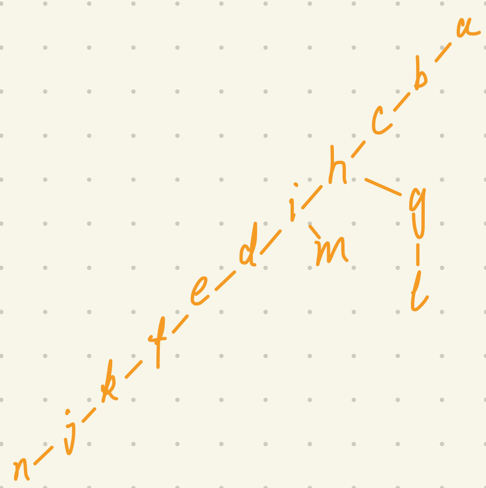

### 11.1

#### 4

a) $a$
b) $a, b, d, e, g, h, i, o$
c) $c, f, j, k, l, m, n, p, q, r, s$
d) Vertex $j$ has no children
e) $d$
f) $p$
g) $g, b, a$
h) $e, f, g, j, k, l, m$

#### 16

Since when $n >= 2$ and $m >= 2$, there must be a simple circuit in $K_{m,n}$, indicating it is not a tree. When $n = 1$ or $m = 1$, there is no simple circuit and $K$ is connected. Hence $K_{m,n}$ is a tree when $m = 1$ or $n = 1$.

#### 20

$[(3-1)100 + 1]/3 = 67$ leaves.

#### 28

$\sum_{k=0}^{h}m^k = \frac{m^{h+1}}{m-1}$ vertices;
$m^h$ leaves.

#### 44

We can follow the rule that colors vertices with the height of odd number with one color, and for those with the height of even number, colors it with another color.

### 11.2

#### 6

$\lceil log_34 \rceil = 2$ weighings. We compare the first two coins. If one is lighter, then it is the counterfeit; otherwise if two are equal, then we compare the other two coins, and the lighter one of them is the counterfeit.

#### 16

First we compare every two vertices to get $2^{k-1}$ winners, and it takes $2^{k-1}$ comparisons. The next round generates $2^{k-2}$ winners and takes $2^{k-2}$ comparisons, until $2^{1-1} = 1$. Hence the number of comparisons is $\sum_{i=1}^{k-1}2^{i-1} = 2^k - 1 = n - 1$.

#### 30

a) A: 0, B: 10, C: 11
b) The frequencies are AA: 0.64, AB: 0.152, AC = 0.008, BA = 0.152, BB = 0.0361, BC = 0.0019, CA = 0.008, CB = 0.0019, CC = 0.0001;
So the Huffman codes are AA: 0, AB: 11, AC: 10111, BA: 100, BB: 1010, BC: 1011011, CA: 101100, CB: 10110100, CC: 10110101
c) For (a), the average number of bits is $1 \times 0.8 + 2 \times (0.19 + 0.01) = 1.2$. For (b), it is $[1 \times 0.64 + 2 \times 0.152 + 3 \times 0.152 + 4 \times 0.0361 + 5 \times 0.008 + 6 \times 0.008 + 7 \times 0.0019 + 8 \times (0.0019 + 0.0001)]/2 = 0.83085$. Hence (b) is more efficient.

### 11.3

#### 6

a) 
b) Since $2.4.2.1$ occurs, then there should be an address with the prefix $2.4.1$, which is not found.
c) Since $1.2.2.1$ occurs, then $1.2.2$ must not be a leaf, which is contradicted to the fact.

#### 18

a) $\leftrightarrow \neg  \wedge p \ q  \ \vee \neg \ p \ \neg \ q$, $\vee \wedge \neg \ p \ \leftrightarrow \ q \ \neg \ p \ \neg \ q$
b) $p \ q \ \wedge \neg \ p \ \neg \ q \ \neg \vee \leftrightarrow$, $p \ \neg \ q \ p \ \neg \leftrightarrow \wedge \ q \ \neg \vee$
c) $((\neg(p \wedge q)) \leftrightarrow ((\neg p) \vee (\neg q)))$, $(((\neg p) \wedge (q \leftrightarrow (\neg p))) \vee (\neg q))$

#### 22

a) $((((5-3)+2)*1)+4)$

b) $((2+3)\uparrow(5-1))$

c) $(9/3)*((2*4)+(7-6))$

#### 34

If $X_1,X_2, \dots, X_n$ are well formuale and * is an n-ary operator, then $*X_1X_2 \dots X_n$ is a well-formed formula.

### 11.4

#### 12

a) 1
b) 2
c) 3

#### 14

#### 22
For the breadth-first search, we can describe it with recursive method. First when n = 0, clearly the tree is a vertex. Suppose T(n) is the tree of Q(n), then T(n+1) should be the copy of T(n), and then connect another T(n) to the root of T(n+1).
For the depth-first search, since n-cube is a Hamilton path, we will eventually get a path.

#### 24

We can order the vertices in the order that we first meet in the search processes.

#### 50

For the edges that are in the $T$, it is true obviously. 
For those are not in the $T$, assuming $uv$. Suppose $u$ is in the higher or the same level of $v$. If $v$ is more than 1 level lower than $u$, then from the process of breadth-first search, we know that the ancestor of $v$ that in the same level of $u$ should take 2 iteration to reach $v$, while $u$ only takes 1, which contradicts the rule of $BFS$. In reserve, for the situation that $v$ is more than 1 level lower than $u$, it is same as well.
If $v$ is 1 level lower than $u$, we know that by the process of $BFS$, $v$'s parent (in the same level of $u$) has the chance to reach $v$ faster than $u$, so it is true, in reverse, too. 
If both of them are in the same level, we know that they are added to $T$ in the same iteration, and the process of edge $uv$ is in the next iteration, it is true as well.

#### 54

Suppose $T_1$ has $a$ edges that are not in $T_2$, $T_2$ has $b$ edges that are not in $T_3$. So the distance between $T_1$ and $T_2$ is $2a$, between $T_2$ and $T_3$ is $2b$. Worst of all, these $(a+b)$ edges are in the $T_1$ and $T_2$, but not in $T_3$. Hence the  distance between $T_1$ and $T_3$ is at most 2(a+b).

### 11.5

#### 4
{a, b}, {a, e}, {a, d}, {c, d}, {d, h}, {a, m}, {d, p}, {e, f}, {e, i}, {g, h}, {l, p}, {m, n}, {n, o}, {f, j}, {k, l}.
Total weight is 28.

#### 8
{a, b}, {a, e}, {c, d}, {d, h}, {a, d}, {a, m}, {d, p}, {e, f}, {e, i}, {g, h}, {l, p}, {m, n}, {n, o}, {f, j}, {k, l}.
Total weight is 28.

#### 10
Prim: choose a vertex to start and add the edge that is shortest and adjacent to the vertex that does not form a simple circuit repeatedly until no vertex can be added. In this case, we choose a vertex not in the constructed spanning forest and follow the steps above to generate another spanning tree. In the end, we can get minimum spanning forest.
Kruskal: choose the shortest edge in the graph that does not form a simple circuit, until no such edges remain. Then we have the minimum spanning forest.

#### 14
{d, h}, {d, e}, {b, f}, {d, g}, {a, b}, {b, e},
{b, c}, {f, i}

#### 18
Suppose we have a minimum
spanning tree that does not contain the minimal edge $uv$(and the edges that have the same weight as $uv$). Then we add edge $uv$ to the spanning tree. In this case we will form a simple circuit. To avoid that, we can the minimal edge $ab$ (except $uv$) to break the circuit, and we get a new spanning tree with the weight $W + W_{uv} - W_{ab} < W$, indicating that $T$ is not a minimum spanning tree. Hence every minimum spanning tree contains the edge with the smallest weight.