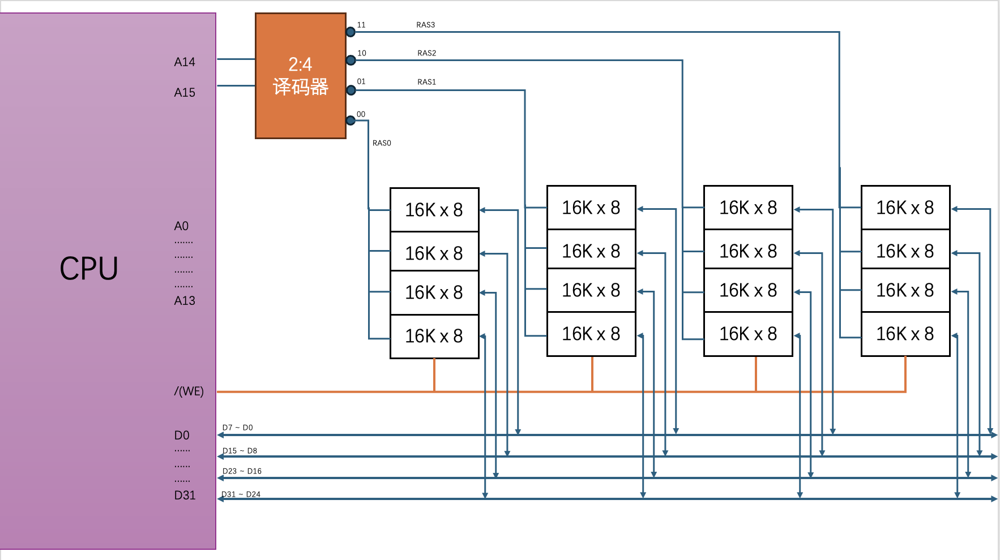

2、设一个具有 20 位地址和 32 位字长的存储器，问：
(1) 该存储器能存储多少字节的信息

> 共可以选中 2^20 个存储单元，每个存储单元可以存储 $32 / 8 = 4$ 字节，共 $2^20 \times 8 = 4MB$

(2) 如果存储器由 $512K \times 8$ 位 SRAM 芯片组成，需要多少片？ 

> 先对 SRAM 做位扩展，需要 $32 / 8 = 4$ 片，再做字扩展，需要 $2^20 / 512K = 2$ 组，共 8 片

(3) 需要多少位地址做芯片选择？

> 一共两组 SRAM 芯片，使用 1 位地址 1:2 译码 做芯片选择

3、已知某 64 位主机采用半导体存储器，其地址码 26 位，若使用 $4M \times 8$ 位的 DRAM 芯片组成该机所允许的最大主存空间，并选用内存条结构形式。问：

(1) 若每个内存条位 $16M \times 64$ 位，共需几个内存条？

> 共需要 $\frac{2^26 \times 64}{16M \times 64} = 4$ 个内存条

(2) 每个内存条共有多少个 DRAM 芯片

> 先对 DRAM 做位扩展，共需要 $64 / 8 = 8$ 片，再做字扩展，需要 $16M / 4M = 4$ 组，共 32 片

(3) 主存共需多少 DRAM 芯片，CPU 如何选择各系统内存

> 共需要 $4 \times 32 = 128$ 片 DRAM 芯片，最高两位 $A_{24}、A_{25}$ 地址线通过 2:4 译码器用于选择内存条，其余用于内存条中存储单元的选择

4、用 $16K \times 8$ 位的 DRAM 芯片构成 $64L \times 32$ 位存储器，画出该存储器的组成逻辑框图

> 